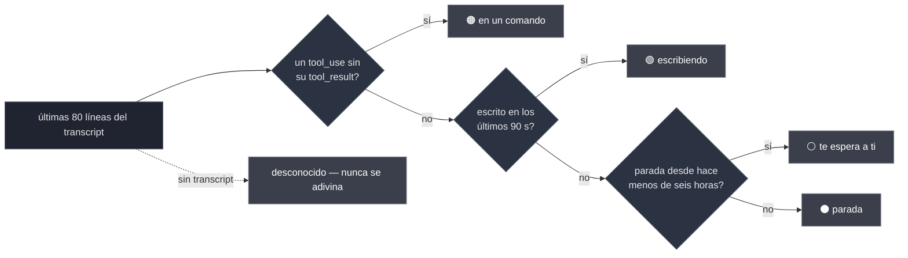

<div align="center">

# sereno

### Nueve sesiones de agente abiertas. ¿Cuál está atascada?

**Una interfaz de terminal que te dice qué está haciendo _de verdad_ cada sesión, no solo que existe.**

Un fichero de Python · cero dependencias · Claude Code, Codex, Gemini, Antigravity

<br>

[](https://github.com/ElRaxy/sereno/actions/workflows/ci.yml)
[](https://github.com/ElRaxy/sereno/releases/latest)
[](https://www.python.org/)
[](#-instalación)
[](#-instalación)
[](LICENSE)
[](https://github.com/ElRaxy/sereno/stargazers)

[English](README.md) · **Español**

<br>


</div>

```bash
curl -fsSL https://raw.githubusercontent.com/ElRaxy/sereno/main/install.sh | sh
sereno
```

---

## Contenido

- [Por qué](#-por-qué)
- [Los cuatro estados](#-los-cuatro-estados-y-por-qué-cuestan)
- [Leer una fila](#-leer-una-fila)
- [Instalación](#-instalación)
- [Uso](#-uso)
- [De dónde salen los datos](#-de-dónde-salen-los-datos)
- [Lo que hace, y lo que no](#-lo-que-hace-y-lo-que-no-hace-a-propósito)
- [Privacidad](#-privacidad)
- [Requisitos](#-requisitos)
- [Preguntas frecuentes](#-preguntas-frecuentes)
- [Configuración](#-configuración)
- [Sobre el código](#-sobre-el-código)
- [Contribuir](#-contribuir)
- [Créditos](#-créditos)

---

## 🌙 Por qué

Un **sereno** era el vigilante nocturno que recorría las calles españolas hasta los años
setenta, con su farol y las llaves de todos los portales de su ronda. Tú dormías; él pasaba a
mirar. Si algo iba mal, era el que se enteraba.

Ahora mismo tienes nueve pestañas abiertas. Dos agentes están a media tarea. Uno lleva once
minutos bloqueado en su propio `pytest`. Otro terminó hace veinte minutos y te está esperando.
Y otro se está comiendo 900 MB por un encargo que abandonaste antes de comer.

Desde fuera las nueve son idénticas. Averiguar cuál es cuál significa entrar en las nueve, leer
la última pantalla de cada una y perder el hilo de lo que estabas haciendo.

**Un gestor de sesiones te dice que las nueve existen. `sereno` te dice qué están haciendo.**

---

## 🔎 Los cuatro estados, y por qué cuestan

|  | qué significa | por qué no sale de un `ps` |
|:--|:--|:--|
| 🟢 **escribiendo** | está redactando la respuesta ahora mismo | — |
| 🟠 **en un comando** | lanzó una herramienta y el resultado no ha vuelto | **este es el que importa** |
| ⚪ **te espera a ti** | terminó y nadie ha contestado | igualito que "se ha caído" |
| ⚫ **parada, te espera a ti** | lo mismo, pero hace más de seis horas | estas son las que conviene cerrar |

Un agente metido en un `Bash` de tres minutos **no escribe nada en su transcript**, así que por
fecha de modificación parece parado — y parado parece abandonado. `sereno` lee la cola del
transcript y comprueba si el último `tool_use` llegó a recibir su `tool_result`.

Esa comprobación es toda la diferencia entre *«se ha colgado»* y *«está trabajando, no la toques»*.



Para un `ps`, los cuatro son el mismo proceso vivo. Y el orden también cuenta: **la comprobación
de la herramienta gana a «está escribiendo»**, porque la línea del `tool_use` acaba de
escribirse en el fichero, así que las dos son ciertas a la vez y solo la segunda dice algo.

> Cada estado lo compone **el código** a partir de hechos tipados leídos del transcript: dos
> booleanos y una fecha. A ningún modelo se le pide que resuma nada, así que nada puede decirte
> con aplomo que una sesión va bien cuando no va. Si los hechos faltan, la fila dice
> `desconocido` en vez de elegir la respuesta amable.

---

## 📖 Leer una fila

```
 ▎ ◐ Refactor payment webhooks  checkout-api ⎇feat/webhooks      now ▰▰▰▰▱  88% 512 MB
 │ │            │                    │            │               │     │     │     │
 │ │            │                    │            │               │     │     │     └ memoria
 │ │            │                    │            │               │     │     └ % de la ventana
 │ │            │                    │            │               │     └ contexto gastado
 │ │            │                    │            │               └ tiempo parada
 │ │            │                    │            └ rama de git
 │ │            │                    └ proyecto
 │ │            └ título — el que Claude se puso, o tu /rename
 │ └ ◐ en un comando · ● escribiendo · nada = te espera
 └ cursor. Se pone amarillo cuando la fila está marcada.
```

**El título es lo último que se recorta.** Estrecha la ventana y ceden antes las columnas de
apoyo, en este orden: la memoria, luego el proyecto (que se estrecha antes de irse) y por
último la barra de contexto. El título aguanta entero hasta unas 45 columnas, porque es lo
único que distingue una sesión de otra. Y ensanchar no vuelve a quitar ninguna columna, así que
redimensionar no hace saltar la fila.

Una columna que no tiene nada que decir no ocupa: sin tmux no hay columna de memoria, y en una
pestaña de Codex no hay columna de contexto, en vez de dieciocho blancos en cada línea.

El panel de la derecha enseña **el último prompt y la última respuesta** de esa sesión, para
que puedas decidir si volver a ella sin abrirla — y además las cifras exactas de contexto
(`176k / 200k`) y el modelo.

### Sobre la barra de contexto

Contesta lo que hoy contestas abriendo la sesión: *¿le cabe otra tarea, o toca compactar?* El
número sale del transcript —cada respuesta apunta lo que costó—, así que no se estima nada ni
se llama a ninguna API.

Lo único que Claude Code no apunta es **el tope**. Una sesión que corre en la ventana de un
millón se registra como `claude-opus-5`, igual que una de 200k. Así que sereno lo deduce en
este orden, y para en el primero que responde:

1. `SERENO_CTX_MAX`, si lo pones tú.
2. Un sufijo `[1m]` en el modelo del transcript.
3. El `model` de tu `~/.claude/settings.json`, que es donde vive hoy ese sufijo.
4. El contexto que ya se ha visto. Una sesión con 560k dentro no tiene un tope de 200k.

La regla 4 es la que mantiene honesta la barra: el porcentaje no puede pasar del 100%, y hay
un test que falla si algún día lo hace.

---

## ⚡ Instalación

En realidad no hay nada que instalar. `sereno` es un fichero de Python. Todas las vías de abajo
acaban con ese mismo fichero en algún sitio de tu `PATH`.

**La de una línea**

```bash
curl -fsSL https://raw.githubusercontent.com/ElRaxy/sereno/main/install.sh | sh
```

**Desde la página de Releases, sin meter un script en la shell**

Si prefieres no pasar un script de internet por `sh` —y como costumbre, mejor no—, entra en
[**Releases**](https://github.com/ElRaxy/sereno/releases/latest), descarga el fichero `sereno`
desde el navegador y luego:

```bash
chmod +x ~/Downloads/sereno && mv ~/Downloads/sereno ~/.local/bin/
```

Cada release lleva al lado un `SHA256SUMS`. Para comprobar que lo que has descargado es lo que
publiqué:

```bash
cd ~/Downloads && shasum -a 256 -c SHA256SUMS      # sha256sum -c en Linux
```

**Desde la página del repositorio**

Abre [`sereno`](https://github.com/ElRaxy/sereno/blob/main/sereno) y usa el botón de descarga de
GitHub. Es el mismo fichero que baja el instalador, en la versión que tenga `main` hoy.

**Con git, si prefieres seguir los cambios**

```bash
git clone https://github.com/ElRaxy/sereno.git && ln -s "$PWD/sereno/sereno" ~/.local/bin/sereno
```

Con el enlace simbólico, un `git pull` actualiza el comando.

**Leer el instalador antes de ejecutarlo**

```bash
curl -fsSLo /tmp/install.sh https://raw.githubusercontent.com/ElRaxy/sereno/main/install.sh
less /tmp/install.sh && sh /tmp/install.sh
```

Son 32 líneas: comprueba que tienes Python 3.8 o más nuevo, baja un fichero a `~/.local/bin` y
te avisa si esa carpeta no está en tu `PATH`. Con `SERENO_BIN` lo pones en otro sitio.

---

Python 3.8 o más nuevo es la lista completa de dependencias. Ni venv, ni lock file, ni cadena de
suministro. Lo mandas por `scp` a un servidor y funciona allí también. Para desinstalarlo,
borras el fichero.

> **Ni Homebrew ni gestor de paquetes, y es a propósito.** Una fórmula es una segunda copia del
> número de versión que se queda vieja la semana que se te olvide. Si lo pide bastante gente me
> lo replanteo: [abre un issue](https://github.com/ElRaxy/sereno/issues).

---

## 🕹 Uso

```bash
sereno            # el selector
sereno --list     # lista y ya, no toca nada
sereno --json     # los mismos hechos, para tu statusline o tus scripts
sereno --watch    # se queda ahí y te avisa en cuanto una para y te espera
sereno --find "eso que recuerdas a medias"
sereno --help
```

### `--find`

Para la sesión que sabes que tuviste y no encuentras. Busca en **lo que se dijo** —tus prompts
y las respuestas del agente— e imprime los aciertos con suficiente línea alrededor para
reconocerlos; después abre el selector con solo esas, así que `ENTER` te devuelve dentro.

```bash
sereno --find "idempotencia del webhook"
sereno --find "idempotencia del webhook" --all   # todo, no solo los 200 más recientes
```

Buscar en los ficheros en crudo habría sido tres líneas más corto e inútil. Medido sobre 506
transcripts aquí: 287 ficheros contenían la palabra y 25 la tenían en algo dicho por alguien. El
resto eran volcados de `tool_result` —greps, contenidos de ficheros, salidas de comandos— y el
`CLAUDE.md` del proyecto, que el CLI pega en **cada** sesión. Con eso dentro, cualquier palabra
de tu propio proyecto casa en todas partes.

### `--watch`

Déjalo en un panel que te sobre. No dice nada hasta que una sesión **deja de trabajar**: el
paso de estar escribiendo (o corriendo un comando suyo) a esperarte a ti. No "está parada":
casi todas lo están casi siempre, y un aviso que salta cada veinte segundos es un aviso que
dejas de leer.

```bash
sereno --watch              # cada 20s
sereno --watch --every 60
```

Te llega un aviso de escritorio (`osascript` en macOS, `notify-send` en Linux — los dos ya
están en tu sistema) y una línea por stdout, así que funciona por SSH y se puede canalizar. La
primera vuelta siempre calla: solo fija la línea base, o arrancarlo te anunciaría todo lo que
ya sabías.

`--json` te da cada sesión con un `state` estable
(`writing` · `in_command` · `waiting` · `stopped` · `unknown`), sus cifras de contexto, la
memoria y los segundos parada. **No lleva conversación dentro**: ni prompt, ni respuesta, ni
nada de lo que se dijo. El selector puede enseñártelo porque estás mirando tu propia pantalla;
un pipe no, así que no lo hace. Hay un test que falla si algún campo cuela una.

```bash
sereno --json | jq -r '.sessions[] | select(.state=="waiting") | .title'
sereno --json --all      # añade el historial reanudable, el equivalente de pulsar TAB
```

<details>
<summary><strong>Tres sitios donde merece la pena engancharlo</strong></summary>

<br>

**Un prompt de shell que diga cuántas te esperan.** Sale barato para correrlo en cada prompt, y
calla cuando la respuesta es cero:

```bash
sereno_espera() {
  local n
  n=$(sereno --json 2>/dev/null | jq '[.sessions[] | select(.state=="waiting")] | length')
  [ "${n:-0}" -gt 0 ] && printf ' ⏳%s' "$n"
}
PS1='$(sereno_espera) \w $ '
```

**Una barra de tmux con la sesión más cerca de compactar.** La que interesa saber es la que se
está quedando sin ventana, no la que más memoria gasta:

```bash
# .tmux.conf
set -g status-right '#(sereno --json | jq -r "[.sessions[] | select(.context_max>0)] \
  | max_by(.context_tokens/.context_max) \
  | \"\(.title[0:24]) \(.context_tokens*100/.context_max | floor)%\"") '
```

**Cualquier cosa que tenga que esperar a que un agente termine.** `state` es un enum cerrado, así
que esto es un bucle y no una apuesta:

```bash
until [ "$(sereno --json | jq -r '.sessions[] | select(.id=="'"$id"'") | .state')" = waiting ]; do
  sleep 20
done
say "te reclama"
```

Todos los campos son tipados y todos los estados salen de ese mismo enum, así que aquí nada tiene
que interpretar prosa. `context_max` vale `null` cuando el tope no consta, que es por lo que la
línea de tmux filtra por él antes de dividir.

</details>

| tecla | |
|:--|:--|
| `↑` `↓` / `j` `k` | moverse |
| `ENTER` | abrirla |
| `SPACE` | marcar · `v` un rango · `a` todas · `i` invertir · `d` las paradas más de una hora |
| `x` | cerrar las marcadas — pregunta antes, y avisa si alguna está a media tarea |
| `/` | filtrar por título mientras escribes |
| `TAB` | Claude · historial reanudable · Codex · Gemini · todas |
| `?` | el resto |

**El ratón funciona.** Click para seleccionar, doble click para abrir, click derecho (o en la
barra del borde izquierdo) para marcar, rueda para desplazar. Las pestañas de arriba y los
botones de abajo son botones de verdad.

Ninguna acción te echa del selector. Cerrar cuatro sesiones y abrir una quinta es una visita,
no cinco.

### 🎭 Probarlo sin tocar tus datos

```bash
sereno --demo          # o SERENO_DEMO=1 sereno
```

Sesiones inventadas, proyectos inventados. **Úsalo para cualquier cosa que publiques.** El panel
de detalle enseña prompts y respuestas reales, así que una captura de un gestor de sesiones es
una forma sorprendentemente eficaz de publicar el trabajo de un cliente — la primera toma del GIF
de arriba salió con nombres de clientes dentro, y por eso existen el modo demo y un test que lo
vigila.

### 🔔 Una línea al abrir la terminal

```bash
# ~/.zshrc o ~/.bashrc
sereno --hook
```

Imprime una línea cuando hay algo corriendo, y absolutamente nada cuando no.

---

## 💾 De dónde salen los datos

Claude Code ya lo escribe todo, en `~/.claude/projects/<proyecto>/<uuid>.jsonl`: una línea de JSON
por evento, según va corriendo la sesión. `sereno` lee las **últimas 80 líneas** de como mucho 40
de esos ficheros y saca de ahí todo lo demás. No hay nada más: ni fichero de configuración, ni
demonio, ni índice, ni telemetría, ni una llamada a ninguna API. Lo instalas y ya conoce todas las
sesiones que has abierto en tu vida.

| qué lee | qué saca de ahí |
|:--|:--|
| la fecha de modificación | si está escribiendo ahora mismo |
| el último par `tool_use` / `tool_result` | si está atascada dentro de un comando |
| el `message.usage` de la última respuesta | contexto gastado, y el modelo |
| `cwd`, `gitBranch` | proyecto y rama |
| `aiTitle`, `lastPrompt` | el título y el panel |

Eso cuesta **4 ms** para las sesiones vivas y **16 ms** para el historial entero, medido contra
1.248 transcripts y 3,8 GB. Y se cachea por fecha de modificación, así que un fichero que no se ha
movido no se lee dos veces.

Las de Codex, Gemini y Antigravity salen de sus propias carpetas de historial y se reabren con el
`resume` de su CLI. Son ficheros en disco, no procesos vivos, así que `sereno` se niega a
«cerrarlas» en vez de fingir que ha hecho algo.

<details>
<summary><strong>Opcional: tmux y Warp</strong></summary>

<br>

Si tus sesiones corren dentro de tmux, además tienes memoria en vivo por sesión, cuáles ya tienen
una terminal enganchada, y poder matarlas de verdad. En macOS con Warp, `ENTER` abre la sesión en
una **ventana nueva** en vez de quedarse con la que estás mirando.

Los dos son opcionales. Sin ellos funciona todo menos la columna de memoria — que entonces no
ocupa nada, en vez de quedarse ahí vacía — y `ENTER` hace `exec` sobre la terminal actual.

</details>

---

## 📊 Lo que hace, y lo que no hace a propósito

Casi todo lo demás que hay en este hueco **lanza y orquesta** sesiones: arranca él los agentes, así
que los conoce porque los ha hecho él. `sereno` no arranca nada. Lee lo que los CLI ya escribieron,
que es justo por lo que ve sesiones que abriste el mes pasado, desde una terminal de la que no ha
oído hablar, en una máquina a la que has entrado por SSH.

**Nunca va a:**

- **lanzar ni orquestar agentes.** Esa es la mitad llena de este hueco, y la mitad que necesita
  adueñarse de tu flujo de trabajo para funcionar. Usa uno de esos para levantar una flota, y luego
  este para ver qué está haciendo.
- **escribir en un transcript, ni en nada que sea de una sesión.** Mata los procesos que le marques,
  y esa es toda la destrucción que lleva dentro.
- **mandar nada a ninguna parte.** No tiene una sola línea de red, y un test del CI tumba la build
  si aparece alguna.
- **preguntarle a un modelo qué le parece.** Cada estado lo compone el código a partir de hechos
  tipados.

Lo que eso te da, en concreto:

|  | sereno | lanzadores y gestores | apps de escritorio |
|:--|:--:|:--:|:--:|
| Ve sesiones que no arrancó él | ✅ | ❌ | 🟡 |
| Estado en vivo por sesión | ✅ | ❌ | 🟡 |
| Último prompt y última respuesta | ✅ | ❌ | 🟡 |
| Contexto gastado por sesión | ✅ | ❌ | ❌ |
| Funciona sin montar nada | ✅ | necesita su lanzador | hay que instalarla |
| Codex y Gemini también | ✅ | solo Claude | solo Claude |
| Va por SSH | ✅ | ✅ | ❌ |
| Dependencias | **ninguna** | tmux | Electron / Swift |

---

## 🔒 Privacidad

Lee tus prompts y las respuestas de tu agente para pintarlos en tu pantalla. Eso merece una
respuesta directa, no una promesa:

**`sereno` no tiene una sola línea de red.** Ni `socket`, ni `urllib`, ni `requests` — la lista
entera de imports es `os, sys, json, re, shlex, shutil, subprocess, time, datetime, pathlib,
unicodedata` y `curses`. Nada de lo que lee puede salir de tu máquina, porque no hay dentro
nada capaz de mandar nada a ningún sitio.

Los únicos programas externos que llega a ejecutar son `ps` (memoria), `tmux` (listar y matar
sesiones), `open` (pasarle una sesión a Warp), `defaults` (leer tu locale en macOS) y —solo bajo
`--watch`— `osascript` / `notify-send` para el aviso de escritorio. Sin telemetría, sin
analíticas, sin comprobación de actualizaciones.

Una cosa que conviene decir clara: un aviso de `--watch` mete el **título de la sesión** en el
centro de notificaciones del sistema, que en una máquina compartida o mientras compartes
pantalla es un sitio donde igual no lo quieres. El aviso lleva el título y el proyecto, nunca la
conversación.

`tests/test_sin_red.py` recorre el AST en cada vuelta de CI y falla si aparece un import de red,
o un binario externo que no esté en esa lista. No hace falta que me creas: el test *es* la
palabra.

En [`SECURITY.md`](SECURITY.md) está la lista completa de lo que lee, lo que escribe y lo que
ejecuta, y es donde se reporta cualquier cosa explotable.

---

## ✅ Requisitos

| | |
|:--|:--|
| **macOS** | funciona, y es donde se construyó |
| **Linux** | funciona — el CI arranca el TUI de verdad en un pty sobre Ubuntu |
| **Windows** | no. `curses` no está en la librería estándar de Python ahí. **Con WSL, sí** |
| **Python** | 3.8 o más nuevo, sin paquetes |
| **Terminal** | cualquiera. Usa 256 colores si los hay y degrada con elegancia si no |

---

## 🩺 Preguntas frecuentes

<details>
<summary><strong>Lo he instalado y no sale nada</strong></summary>

<br>

Mira `ls ~/.claude/projects`, que es lo único que necesita. Si la carpeta está vacía es que no
has usado Claude Code en esta máquina (o `$HOME` no es el que crees, cosa que pasa bajo `sudo`).

Si lista sesiones pero faltan las que esperabas, seguramente estén en la pestaña
**`historial`** y no en `claude`: todo aquello cuyo transcript lleve más de 90 segundos quieto
cuenta como reanudable, no como vivo. Pulsa `TAB`.

</details>

<details>
<summary><strong>`x` me dice «historial, no procesos: no hay nada que cerrar»</strong></summary>

<br>

Correcto, y a propósito. Sin tmux no hay proceso que matar: la sesión es un fichero en disco.
`sereno` se niega en vez de fingir que ha hecho algo. Usa `ENTER` para reanudarla, o borra tú el
transcript si lo que quieres es que desaparezca.

</details>

<details>
<summary><strong>La columna de memoria está vacía</strong></summary>

<br>

La memoria es por proceso, y solo conoce el proceso si la sesión corre dentro de tmux bajo el
socket que vigila (`SERENO_TMUX_SOCK`, por defecto `claude-code`). Lo demás sigue funcionando.

</details>

<details>
<summary><strong>¿Ralentiza algo? ¿Toca mis sesiones?</strong></summary>

<br>

Lee la **cola** de 40 transcripts como mucho y cachea por fecha de modificación: 4 ms para los
vivos, 16 ms para el historial completo, medido sobre 1.248 transcripts y 3,8 GB. Nunca escribe
en un transcript. Lo único que escribe es un fichero de arranque de Warp, y solo cuando pulsas
`ENTER` en una máquina que tiene Warp.

</details>

<details>
<summary><strong>¿Cómo lo desinstalo?</strong></summary>

<br>

```bash
rm ~/.local/bin/sereno
```

Ya está. No crea configuración, ni caché, ni carpeta de estado propia.

</details>

---

## 🔧 Configuración

No hay fichero de configuración. Todo son variables de entorno, así que de esto no queda nada en
tu máquina si borras el script.

| Variable | Por defecto | |
|:--|:--|:--|
| `SERENO_LANG` | tu locale | `en` o `es`. En macOS lee `AppleLocale` |
| `SERENO_DEMO` | apagado | `1` para sesiones inventadas. Ponla antes de cualquier captura |
| `SERENO_CTX_MAX` | deducido | tope de contexto en tokens, cuando la cascada falla |
| `SERENO_TMUX_SOCK` | `claude-code` | qué socket de tmux se lee |
| `SERENO_REGISTRY` | `~/.claude/warp-sessions` | dónde vive el registro opcional del lanzador |
| `SERENO_BIN` | `~/.local/bin` | dónde deja el fichero `install.sh` |
| `SERENO_DEBUG` | apagado | `1` para que el selector no se trague un error de curses. Útil
  si sale sin decir por qué |

```bash
# ventana de un millón, en inglés, sin tocar nada permanente
SERENO_CTX_MAX=1000000 SERENO_LANG=en sereno
```

---

## 🧠 Sobre el código

Un fichero, unas 3.200 líneas, solo librería estándar.

Los comentarios están **en castellano** a propósito. Explican *por qué* está cada cosa como está,
casi siempre nombrando el incidente que lo provocó, y traducirlos lo aplanaría a prosa genérica.
La interfaz sí es bilingüe.

<details>
<summary><strong>Tres decisiones que merece la pena conocer</strong></summary>

<br>

**La fila del cursor cambia de fondo, no de vídeo.** `A_REVERSE` pinta la fila entera de blanco y
tira a la basura el color de cada columna —el estado, el proyecto, la memoria— justo en la única
fila que estás mirando.

**Los eventos de ratón se parsean a mano.** El ncurses que trae macOS es el 6.0 de **2015** y solo
habla el protocolo x11 de 1988, donde la columna viaja en un byte y muere en la 223. En una
ventana ancha, los clicks del panel derecho aterrizan en otro sitio. `sereno` pide SGR y lo parsea
él, sin dejar de aceptar `KEY_MOUSE` de un ncurses moderno.

**Los `agent-*.jsonl` no son sesiones.** Claude Code deja los transcripts de sus subagentes al
lado de los reales: 213 contra 1.035 en la máquina donde se construyó esto. No se reanudan y no
tienen título propio, así que la lista salía enterrada bajo veinte copias del mismo prompt de
subagente hasta que se filtraron.

</details>

---

Los cambios entre versiones están en [CHANGELOG.md](CHANGELOG.md).

## 🤝 Contribuir

Issues y pull requests bienvenidos, en castellano o en inglés. Antes de abrir uno, pasa los tests:

```bash
for t in tests/test_*.py; do python3 "$t"; done
```

Son diez, y el CI los corre en macOS y Ubuntu contra Python 3.8, 3.12 y 3.13. Casi todos vigilan
algo que falla **en silencio**, que es justo por lo que existen:

- **`test_demo_aislado.py`** — el modo demo no puede devolver ni una fila que venga del disco de
  verdad. Planta un canario en un `HOME` de mentira y recorre todas las funciones que leen datos.
- **`test_i18n.py`** — cada cadena que se imprime pasa por `_()` y tiene traducción con los mismos
  `{huecos}`. Recorre el AST, así que también caza una frase escrita a pelo. El inglés es la clave,
  así que una traducción que falta no revienta: aparece en el idioma equivocado y ya.
- **`test_sin_red.py`** — ni sockets, ni un binario externo fuera de la lista declarada.
- **`test_contexto.py`** — la barra de contexto no puede pasar del 100%.
- **`test_json_sin_conversacion.py`** — `--json` no lleva dentro ni prompt ni respuesta.
- Y el TUI arrancando en un pty, `--watch` avisando en el flanco, `--find` leyendo solo lo dicho,
  los flags desconocidos diciéndose, y una sesión reanudada seguida hasta el fichero que escribe.

Dos normas de la casa:

- **Un test que no has visto fallar no vale.** Rompe el código a propósito, míralo ponerse rojo y
  arréglalo. La mitad de estos se escribieron así, después de que la primera versión diera por
  bueno algo que no lo era.
- **Las actions van fijadas por SHA** y el repositorio lo exige, así que un cambio de workflow con
  `@v4` se rechaza. Las subidas de versión las abre Dependabot.

El GIF se regenera con `vhs demo.tape` ([vhs](https://github.com/charmbracelet/vhs)) — y mirando
los fotogramas antes de commitearlos. Con `SERENO_DEMO=1` delante, siempre: el panel enseña
prompts de verdad.

Cualquier cosa explotable va a [`SECURITY.md`](SECURITY.md), no a un issue público.

---

## 👤 Créditos

Hecho por **[Alex Micó](https://github.com/ElRaxy)**, que tenía nueve pestañas de Claude Code
abiertas y ni idea de a cuál volver.

Escrito con **Claude Code (Opus 5)** de coautor — incluida la tarde que se fue en descubrir que
macOS trae un ncurses de 2015. Apropiado, para una herramienta cuyo trabajo es vigilar sesiones de
Claude Code.

Si te ahorra una ronda de clicks por nueve pestañas, una ⭐ ayuda a que lo encuentre más gente.

---

## 📄 Licencia

MIT — mira [LICENSE](LICENSE). Haz con esto lo que quieras.
