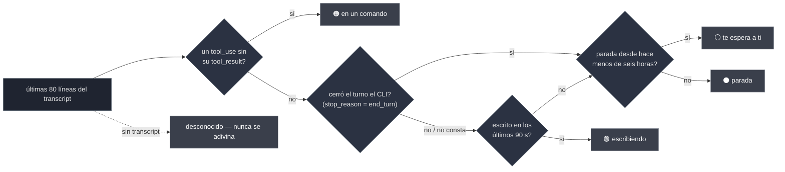

<div align="center">


# sereno

### Nueve sesiones de agente abiertas. ¿Cuál está atascada?

**Una interfaz de terminal que te dice qué está haciendo _de verdad_ cada sesión, no solo que existe.**

Un fichero de Python · cero dependencias · Claude Code, Codex, Gemini, Antigravity

<br>

[](https://github.com/ElRaxy/sereno/actions/workflows/ci.yml)
[](https://github.com/ElRaxy/sereno/releases/latest)
[](https://www.python.org/)
[](#-instalación)
[](#-instalación)
[](LICENSE)
[](https://github.com/ElRaxy/sereno/stargazers)

[English](README.md) · **Español**

<br>


</div>

```bash
brew install elraxy/tap/sereno
sereno
```

---

## Contenido

- [Por qué](#-por-qué)
- [Los cuatro estados](#-los-cuatro-estados-y-por-qué-cuestan)
- [Leer una fila](#-leer-una-fila)
- [Instalación](#-instalación)
- [Uso](#-uso)
- [De dónde salen los datos](#-de-dónde-salen-los-datos)
- [Lo que hace, y lo que no](#-lo-que-hace-y-lo-que-no-hace-a-propósito)
- [Privacidad](#-privacidad)
- [Requisitos](#-requisitos)
- [Preguntas frecuentes](#-preguntas-frecuentes)
- [Configuración](#-configuración)
- [Sobre el código](#-sobre-el-código)
- [Contribuir](#-contribuir)
- [Créditos](#-créditos)

---

## 🌙 Por qué

Un **sereno** era el vigilante nocturno que recorría las calles españolas hasta los años
setenta, con su farol y las llaves de todos los portales de su ronda. Tú dormías; él pasaba a
mirar. Si algo iba mal, era el que se enteraba.

Ahora mismo tienes nueve pestañas abiertas. Dos agentes están a media tarea. Uno lleva once
minutos bloqueado en su propio `pytest`. Otro terminó hace veinte minutos y te está esperando.
Y otro se está comiendo 900 MB por un encargo que abandonaste antes de comer.

Desde fuera las nueve son idénticas. Averiguar cuál es cuál significa entrar en las nueve, leer
la última pantalla de cada una y perder el hilo de lo que estabas haciendo.

**Un gestor de sesiones te dice que las nueve existen. `sereno` te dice qué están haciendo.**

---

## 🔎 Los cuatro estados, y por qué cuestan

|  | qué significa | por qué no sale de un `ps` |
|:--|:--|:--|
| 🟢 **escribiendo** | está redactando la respuesta ahora mismo | — |
| 🟠 **en un comando** | lanzó una herramienta y el resultado no ha vuelto | **este es el que importa** |
| ⚪ **te espera a ti** | terminó y nadie ha contestado | igualito que "se ha caído" |
| ⚫ **parada, te espera a ti** | lo mismo, pero hace más de seis horas | estas son las que conviene cerrar |

Un agente metido en un `Bash` de tres minutos **no escribe nada en su transcript**, así que por
fecha de modificación parece parado — y parado parece abandonado. `sereno` lee la cola del
transcript y comprueba si el último `tool_use` llegó a recibir su `tool_result`.

Esa comprobación es toda la diferencia entre *«se ha colgado»* y *«está trabajando, no la toques»*.

La fecha de modificación miente también al revés: sigue fresca durante los noventa segundos
**posteriores** a que la sesión te conteste, que es justo la ventana en la que quieres saber cuál
te está esperando ya. Así que al transcript se le hace una segunda pregunta: ¿cerró el turno el
CLI? Pulsar ESC cuenta como cerrarlo: una sesión que acabas de interrumpir es la que más
claramente te espera.

Medido el 2026-08-28 contra el propio spinner de Claude Code sobre nueve sesiones vivas,
**16 de 48 muestras que decían `escribiendo` eran sesiones ya paradas** — un tercio. Ninguna al
revés, así que el error tenía dirección: escondía justo las que te reclamaban. Con la
comprobación del turno, el mismo banco da 4 de 26.



Para un `ps`, los cuatro son el mismo proceso vivo. Y el orden también cuenta: **la comprobación
de la herramienta gana a «está escribiendo»**, porque la línea del `tool_use` acaba de
escribirse en el fichero, así que las dos son ciertas a la vez y solo la segunda dice algo.

> Cada estado lo compone **el código** a partir de hechos tipados leídos del transcript: tres
> booleanos y una fecha. A ningún modelo se le pide que resuma nada, así que nada puede decirte
> con aplomo que una sesión va bien cuando no va. Si los hechos faltan, la fila dice
> `desconocido` en vez de elegir la respuesta amable.

---

## 📖 Leer una fila

```
 ▎ ◐ Refactor payment webhooks  checkout-api ⎇feat/webhooks      now ▰▰▰▰▱  88% 512 MB
 │ │            │                    │            │               │     │     │     │
 │ │            │                    │            │               │     │     │     └ memoria
 │ │            │                    │            │               │     │     └ % de la ventana
 │ │            │                    │            │               │     └ contexto gastado
 │ │            │                    │            │               └ tiempo parada
 │ │            │                    │            └ rama de git
 │ │            │                    └ proyecto
 │ │            └ título — el que Claude se puso, o tu /rename
 │ └ ◐ en un comando · ● escribiendo · nada = te espera
 └ cursor. Se pone amarillo cuando la fila está marcada.
```

Entre el estado y el título va una columna más, y lleva dos avisos: `⧉`, otra sesión está
escribiendo en el mismo sitio, y `↻`, esta está dando vueltas. Cuando coinciden, el choque se
queda la columna — si no lo ves, dos sesiones pueden pisarse el trabajo; si no ves el otro,
pierdes minutos. Los dos salen enteros en el panel y en `--list`.

**El título es lo último que se recorta.** Estrecha la ventana y ceden antes las columnas de
apoyo, en este orden: la memoria, luego el proyecto (que se estrecha antes de irse) y por
último la barra de contexto. El título aguanta entero hasta unas 45 columnas, porque es lo
único que distingue una sesión de otra. Y ensanchar no vuelve a quitar ninguna columna, así que
redimensionar no hace saltar la fila.

Una columna que no tiene nada que decir no ocupa: sin tmux no hay columna de memoria, y en una
pestaña de Codex no hay columna de contexto, en vez de dieciocho blancos en cada línea.

El panel de la derecha enseña **el último prompt y la última respuesta** de esa sesión, para
que puedas decidir si volver a ella sin abrirla — y además las cifras exactas de contexto
(`176k / 200k`) y el modelo.

### Lo que ha estado haciendo

El panel dice lo último que hizo una sesión. Lo que no dice es el **camino**, que es donde se
ve si avanza o da vueltas. Debajo del prompt y de la respuesta va un rastro corto de las
últimas llamadas a herramienta, cada una con lo que tardó y cómo acabó:

```
▸ lo que ha estado haciendo  (+4 antes)
  ! el mismo comando ha fallado 3 veces
  ·    2s  Read · tests/webhooks/test_retry.py
  ·    1s  Edit · src/webhooks/handler.py
  ✗   34s  Bash · pytest tests/webhooks -x -q
  ✗   31s  Bash · pytest tests/webhooks -x -q
  ✗   33s  Bash · pytest tests/webhooks -x -q
  ◐   12m  Bash · pytest tests/webhooks -x -q
```

`·` hecha · `✗` volvió con error · `∅` una búsqueda que no encontró nada · `◐` todavía
corriendo, con el reloj andando.

Las dos líneas que empiezan por `!` son los únicos juicios de la pantalla, y ninguno es una
corazonada: se cuentan, no se intuyen. **El mismo comando fallando tres veces seguidas** es
donde para una persona, y tres es además el presupuesto de reintentos que este proyecto ya usa
en todo lo demás. **Dos búsquedas seguidas que no encuentran nada** es el otro, y es dos y no
tres a propósito: un reintento fallido puede ser un flake, pero una segunda búsqueda que vuelve
vacía ya dice que la pregunta está mal hecha. Cualquier otra cosa por medio corta la cuenta:
dos greps vacíos con una edición en medio son trabajo, no un barrido.

No cuesta ni una lectura más. El rastro sale de la misma cola del transcript que el panel ya
abre, y solo para la fila bajo el cursor — y las mismas dos cuentas se hacen para todas las
filas en pantalla, con la pasada que `sereno` ya da, que es lo que pone el `↻` en la lista sin
esperar a que te acerques a esa fila.

**Cuenta con que esto hable poco.** Sobre 10.375 llamadas reales de los doce transcripts más
grandes de la máquina donde se escribió, el aviso de bucle saltó en **cero** ventanas y el de
barrido en **una**. No es un fallo, y los umbrales no se aflojaron para sacar un número más
lucido: cuando un comando falla, el intento siguiente suele ser un comando ligeramente distinto,
así que tres idénticos seguidos es raro. Un aviso que sale a todas horas es un aviso que dejas
de leer, y las cuentas se quedan donde las puso la evidencia.

Veinte minutos colgada de una llamada **no** se lleva una línea propia — eso ya lo dice
`estado`, y el mismo hecho dos veces no es una segunda opinión. El rastro lo enseña como lo que
es: un glifo y un reloj.

### Las que nunca arrancaron

Una sesión cuyas respuestas no consumieron ni un token nunca recibió una contestación, y reanudarla
te devuelve su error de arranque y nada más. Esas ordenan por debajo de todo, se pintan en gris y
la cabecera las cuenta aparte — `3 reanudables · 1 sin arrancar`, no `4 reanudables`.

El caso especial se gana el sitio. En la máquina donde se escribió esto eran 21 de 39 filas del
historial, y 16 de ellas la misma sesión relanzada en bucle y muerta en el acto con `API Error: 401
· Please run /login`. Como acababan de morir, eran las filas más recientes, así que el orden por
defecto las ponía arriba de una lista cuyo único trabajo es decirte a cuál volver.

Dos guardas, las dos porque un cero no siempre es un cero:

- Solo con el transcript leído entero. A medias, un cero significa *todavía no se sabe*.
- **Nunca una sesión viva.** Una que acabas de lanzar aún no ha contestado, y es justo la fila que
  más quieres ver.

### Las que ya no tienen sitio al que volver

Una sesión cuyo directorio de trabajo ya no existe no admite vuelta: reanudarla te deja en un `cd`
a un sitio que no está. Mismo trato que las de arriba — al fondo, en gris y contadas aparte.

Es la gemela del caso anterior y hace la misma pregunta por el otro lado. Aquellas nunca
contestaron; estas contestaron de sobra y perdieron el destino.

En la máquina donde se escribió esto eran **40 de las 46 filas** del historial. Y no es el
resultado raro de una tarde: quitando las 53 sesiones que un optimizador dejó esa mañana, siguen
siendo **28 de 37**, de dos clases muy concretas — worktrees ya borradas (10 de 15) y directorios
temporales (18 de 18, todos).

Se hunden, no se ocultan. Un directorio que hoy no está puede ser una worktree que vuelvas a crear
o un disco que vuelvas a montar, y la comprobación se cachea por ruta durante 30 segundos, así que
la fila vuelve sola. Esconderlas sería cambiar un error por el contrario.

El caché evita que la comprobación se repita, y eso es todo lo que evita: la recarga corre síncrona
en el bucle que pinta, así que un montaje de red colgado —donde un `stat` no vuelve nunca— congela
la lista. Medido inyectando 1 s de latencia por `stat`: 37,4 s la primera pasada.

Dos guardas, las dos porque un directorio ausente no siempre es un directorio ausente:

- **Sin ruta no hay afirmación.** Una sesión sin `cwd` anotado no se marca nunca: señalar una fila
  por un dato que falta es justo el error que esto arregla.
- **Nunca una sesión viva.** Su proceso corre dentro de ese directorio, así que existe por
  definición, y preguntarlo sería gastar un `stat` para confirmar lo obvio.

El hecho también sale en `--json`, como `cwd_exists`, para que una statusline filtre lo reanudable
de verdad en vez de adivinarlo por el nombre del proyecto.

### Sobre la barra de contexto

Contesta lo que hoy contestas abriendo la sesión: *¿le cabe otra tarea, o toca compactar?* El
número sale del transcript —cada respuesta apunta lo que costó—, así que no se estima nada ni
se llama a ninguna API.

Lo único que Claude Code no apunta es **el tope**. Una sesión que corre en la ventana de un
millón se registra como `claude-opus-5`, igual que una de 200k. Así que sereno lo deduce en
este orden, y para en el primero que responde:

1. `SERENO_CTX_MAX`, si lo pones tú. Lo has dicho tú, no se discute.
2. **Lo que dice esta sesión.** Primero la línea `cost-state` que el CLI escribe al cerrar —su
   `modelUsage` va indexado por `claude-opus-5[1m]`, con el sufijo— y, si no la hay, el sufijo
   `[1m]` en el modelo del transcript.
3. El `model` de tu `~/.claude/settings.json`. Eso es la *máquina*, no la sesión.
4. Si no hay nada de lo anterior, la ventana estándar.
5. Y por encima de todo lo de 2-4, una guarda: el tope no puede quedar por debajo del contexto
   ya visto. Una sesión con 560k dentro no tiene un tope de 200k lo diga quien lo diga.

La regla 5 es la que mantiene honesta la barra: el porcentaje no puede pasar del 100%, y hay un
test que falla si algún día lo hace.

**Y esa guarda tiene memoria: mira también el pico**, no solo el contexto de ahora. Compactar
borra la prueba —la ventana cae a 16k y una sesión de un millón pasa a dibujarse contra la
estándar—, así que el pico se reconstruye del transcript: el `usage` de cada respuesta y el
`preTokens` de cada compactación, que es contexto y no un acumulado (comprobado contra la
respuesta anterior: mediana +0,4%, 165 de 169 dentro del ±5%).

Sobre los 524 transcripts de la máquina donde se escribió esto, el pico corrige **30** (5,7%) y
los 30 hacia el mismo lado: uno marcaba 171k sobre 200k —un **86%**, "compacta ya"— cuando eran
171k de un millón, un **17%**. Como cobertura, `preTokens` aparece en 107 de 524 transcripts
frente a los 13 del `cost-state`.

El pico sale de leer el transcript entero, y **eso lo hace ahora también la lista**, un trozo por
refresco: ver [Leer sin bloquear](#leer-sin-bloquear). Y el sentido contrario —probar que una sesión
*no* es de un millón— no tiene más evidencia que el `cost-state`: en esos 524 transcripts no hay
ni una auto-compactación (que delataría el umbral) ni un solo `message.model` con sufijo.

**La 2 va antes que la 3, y funciona en los dos sentidos.** Tu configuración global es la floja
—una sesión lanzada con otro `--model` no la cumple— así que el único hecho que describe *esta*
sesión manda sobre ella, para subir el tope **y** para bajarlo. Con el orden anterior, una
sesión de 200k en una máquina configurada para la ventana grande se pintaba sobre un millón: un
6% donde tocaba un 30%.

El sentido que baja se apoya en un caso que no se ha visto en la máquina donde se escribió esto:
de los 15 transcripts con `cost-state`, los 11 que nombran un modelo principal lo nombran con
sufijo, y los otros cuatro traen el `modelUsage` vacío. La regla 5 acota lo que puede salir mal
—bajar por debajo de lo ya gastado es imposible—. Y el Haiku que el CLI usa para los títulos se
ignora al leer esa línea: si no, una conversación de nada bajaría el tope por su cuenta.

---

## ⚡ Instalación

En realidad no hay nada que instalar. `sereno` es un fichero de Python. Todas las vías de abajo
acaban con ese mismo fichero en algún sitio de tu `PATH`.

**Con Homebrew**

```bash
brew install elraxy/tap/sereno
```

Es la única vía que además te **actualiza**: `brew upgrade` te trae la siguiente versión sin
que tengas que enterarte de que existe.

**La de una línea**

```bash
curl -fsSL https://raw.githubusercontent.com/ElRaxy/sereno/main/install.sh | sh
```

**Desde la página de Releases, sin meter un script en la shell**

Si prefieres no pasar un script de internet por `sh` —y como costumbre, mejor no—, entra en
[**Releases**](https://github.com/ElRaxy/sereno/releases/latest), descarga el fichero `sereno`
desde el navegador y luego:

```bash
chmod +x ~/Downloads/sereno && mv ~/Downloads/sereno ~/.local/bin/
```

Cada release lleva al lado un `SHA256SUMS`. Para comprobar que lo que has descargado es lo que
publiqué:

```bash
cd ~/Downloads && shasum -a 256 -c SHA256SUMS      # sha256sum -c en Linux
```

**Desde la página del repositorio**

Abre [`sereno`](https://github.com/ElRaxy/sereno/blob/main/sereno) y usa el botón de descarga de
GitHub. Es el mismo fichero que baja el instalador, en la versión que tenga `main` hoy.

**Con git, si prefieres seguir los cambios**

```bash
git clone https://github.com/ElRaxy/sereno.git && ln -s "$PWD/sereno/sereno" ~/.local/bin/sereno
```

Con el enlace simbólico, un `git pull` actualiza el comando.

**Leer el instalador antes de ejecutarlo**

```bash
curl -fsSLo /tmp/install.sh https://raw.githubusercontent.com/ElRaxy/sereno/main/install.sh
less /tmp/install.sh && sh /tmp/install.sh
```

Son 32 líneas: comprueba que tienes Python 3.8 o más nuevo, baja un fichero a `~/.local/bin` y
te avisa si esa carpeta no está en tu `PATH`. Con `SERENO_BIN` lo pones en otro sitio.

---

Python 3.8 o más nuevo es la lista completa de dependencias. Ni venv, ni lock file, ni cadena de
suministro. Lo mandas por `scp` a un servidor y funciona allí también. Para desinstalarlo,
borras el fichero.

> **Aquí ponía que no habría fórmula de Homebrew, y el motivo era bueno:** una fórmula es una
> segunda copia del número de versión, y una copia que escribe una persona se queda vieja la
> semana que se te olvide. Lo que cambió no fue la opinión, fue que ese número ya no lo escribe
> nadie. `release.sh` bumpea la fórmula él mismo, y solo **después** de haberse descargado el
> asset publicado y haber comprobado que es el programa y que dice ser esa versión — así que el
> tap no puede apuntar a algo que no se haya verificado. Vive en
> [**ElRaxy/homebrew-tap**](https://github.com/ElRaxy/homebrew-tap), tiene su propio CI en macOS
> y en Linux, y la fórmula vuelve a comprobar el shebang y la versión antes de instalar nada:
> la v1.13.0 se publicó con un asset que no era el programa, y las releases de GitHub son
> inmutables, así que ese fichero roto sigue ahí para siempre.

---

## 🕹 Uso

```bash
sereno            # el selector
sereno --list     # lista y ya, no toca nada
sereno --json     # los mismos hechos, para tu statusline o tus scripts
sereno --watch    # se queda ahí y te avisa en cuanto una para y te espera
sereno --find "eso que recuerdas a medias"
sereno --usage    # añade lo que lleva quemado cada sesión
sereno --disk     # lo que pesan los transcripts, por proyecto
sereno --now      # qué está ejecutando cada sesión viva, todas de una vez
sereno --help
```

### `--find`

Para la sesión que sabes que tuviste y no encuentras. Busca en **lo que se dijo** —tus prompts
y las respuestas del agente— e imprime los aciertos con suficiente línea alrededor para
reconocerlos; después abre el selector con solo esas, así que `ENTER` te devuelve dentro.

```bash
sereno --find "idempotencia del webhook"
sereno --find "idempotencia del webhook" --all   # todo, no solo los 200 más recientes
```

Buscar en los ficheros en crudo habría sido tres líneas más corto e inútil. Medido sobre 506
transcripts aquí: 287 ficheros contenían la palabra y 25 la tenían en algo dicho por alguien. El
resto eran volcados de `tool_result` —greps, contenidos de ficheros, salidas de comandos— y el
`CLAUDE.md` del proyecto, que el CLI pega en **cada** sesión. Con eso dentro, cualquier palabra
de tu propio proyecto casa en todas partes.

### `--watch`

Déjalo en un panel que te sobre. No dice nada hasta que una sesión **deja de trabajar**: el
paso de estar escribiendo (o corriendo un comando suyo) a esperarte a ti. No "está parada":
casi todas lo están casi siempre, y un aviso que salta cada veinte segundos es un aviso que
dejas de leer.

```bash
sereno --watch              # cada 20s
sereno --watch --every 60
```

Avisa de tres cambios, y solo de cambios: que una sesión **pare**, que dos **empiecen** a
escribir en el mismo sitio, y que una **empiece** a dar vueltas. Veinte minutos del mismo bucle
son una línea, no una por vuelta — y una sesión que ya estaba dando vueltas cuando arrancaste
`--watch` es parte de la línea base, no una novedad.

Te llega un aviso de escritorio (`osascript` en macOS, `notify-send` en Linux — los dos ya
están en tu sistema) y una línea por stdout, así que funciona por SSH y se puede canalizar. La
primera vuelta siempre calla: solo fija la línea base, o arrancarlo te anunciaría todo lo que
ya sabías.

`--json` te da cada sesión con un `state` estable
(`writing` · `in_command` · `waiting` · `stopped` · `unknown`), sus cifras de contexto, la
memoria y los segundos parada. **No lleva conversación dentro**: ni prompt, ni respuesta, ni
nada de lo que se dijo. El selector puede enseñártelo porque estás mirando tu propia pantalla;
un pipe no, así que no lo hace. Hay un test que falla si algún campo cuela una.

```bash
sereno --json | jq -r '.sessions[] | select(.state=="waiting") | .title'
sereno --json --all      # añade el historial reanudable, el equivalente de pulsar TAB
sereno --json | jq -r '.sessions[] | .session_id'   # para pasárselos a `claude --resume`
```

**`id` y `session_id` no son lo mismo, y conviene saber cuál quieres.** `id` es la **clave de la
fila**: el nombre de la sesión de tmux en una viva (`cc-VanguardIA-90a6fb95`) y el uuid en una del
historial — sirve para casar filas entre dos llamadas. `session_id` es el **id de la sesión de
Claude**, el que se le pasa a `--resume`, y es `null` si la fila es de otro CLI. Iban mezclados en
un solo campo hasta la 1.10.0, y en el selector eso significaba que la tecla que copia daba un
nombre de tmux que no reanudaba nada.

<details>
<summary><strong>Tres sitios donde merece la pena engancharlo</strong></summary>

<br>

**Un prompt de shell que diga cuántas te esperan.** Sale barato para correrlo en cada prompt, y
calla cuando la respuesta es cero:

```bash
sereno_espera() {
  local n
  n=$(sereno --json 2>/dev/null | jq '[.sessions[] | select(.state=="waiting")] | length')
  [ "${n:-0}" -gt 0 ] && printf ' ⏳%s' "$n"
}
PS1='$(sereno_espera) \w $ '
```

**Una barra de tmux con la sesión más cerca de compactar.** La que interesa saber es la que se
está quedando sin ventana, no la que más memoria gasta:

```bash
# .tmux.conf
set -g status-right '#(sereno --json | jq -r "[.sessions[] | select(.context_max>0)] \
  | max_by(.context_tokens/.context_max) \
  | \"\(.title[0:24]) \(.context_tokens*100/.context_max | floor)%\"") '
```

**Cualquier cosa que tenga que esperar a que un agente termine.** `state` es un enum cerrado, así
que esto es un bucle y no una apuesta:

```bash
until [ "$(sereno --json | jq -r '.sessions[] | select(.id=="'"$id"'") | .state')" = waiting ]; do
  sleep 20
done
say "te reclama"
```

Todos los campos son tipados y todos los estados salen de ese mismo enum, así que aquí nada tiene
que interpretar prosa. `context_max` vale `null` cuando el tope no consta, que es por lo que la
línea de tmux filtra por él antes de dividir.

</details>

| tecla | |
|:--|:--|
| `↑` `↓` / `j` `k` | moverse |
| `ENTER` | abrirla |
| `SPACE` | marcar · `v` un rango · `a` todas · `i` invertir · `d` las paradas más de una hora |
| `r` | abrir las marcadas de una vez, una pestaña cada una |
| `c` | entregar las marcadas a otro CLI — ver abajo |
| `n` | qué están ejecutando **todas**, en una pantalla |
| `x` | cerrar las marcadas — pregunta antes, y avisa si alguna está a media tarea |
| `s` / `S` | ordenar por actividad · contexto · proyecto · memoria · **gasto** / invertir |
| `y` | copiar el id de la sesión, el que se le pasa a `claude --resume` (o pincharlo — ver abajo) |
| `/` | filtrar por título mientras escribes |
| `TAB` | Claude · historial reanudable · Codex · Gemini · todas |
| `?` | el resto |

**El ratón funciona.** Click para seleccionar, doble click para abrir, click derecho (o en la
barra del borde izquierdo) para marcar, rueda para desplazar. Las pestañas de arriba y los
botones de abajo son botones de verdad.

**Y los valores subrayados se copian al pincharlos.** Con sereno abierto no puedes seleccionar
arrastrando: el reporte de ratón está encendido y el terminal le pasa el arrastre a la
aplicación. Así que lo que ibas a volver a teclear es un click: el proyecto, el id de sesión y
las cabeceras de *what you last said* y *what it last replied*, que copian el texto entero y no
el trozo que cupo. Va por OSC 52, que no necesita ningún programa extra y funciona por SSH; el
rótulo de abajo dice siempre qué ha llegado al portapapeles.

Dos de ellos copian a propósito algo que no se puede leer en pantalla: `project` enseña
`docs-site · main` y copia `/Users/you/code/docs-site`, y la cabecera de la respuesta la copia
entera. Un click que copiara lo pintado te devolvería justo lo que acabas de leer.

Ninguna acción te echa del selector. Cerrar cuatro sesiones y abrir una quinta es una visita,
no cinco.

### `--usage`

La barra de contexto dice lo llena que está la ventana **ahora mismo**. No dice cuánto lleva
quemado la sesión: una que ha compactado tres veces marca 20% con doce horas dentro. `--usage`
añade eso — entrada y salida, caché leída, cuántas respuestas, cuántas compactaciones, el pico
de contexto al que llegó y los minutos que de verdad estuvo trabajando.

```bash
sereno --list --usage
sereno --json --usage | jq -r '.sessions[] | "\(.title)  \(.output_tokens) salida"'
```

Va apagado por defecto porque la cifra está repartida por todo el transcript: la cola no sirve,
hay que leer el fichero entero. Medido aquí, son 0,11 ms el transcript mediano y 223 ms el mayor
del disco (89 MB) — bien cuando lo pides, mal para una statusline que corre cada pocos segundos.

#### Leer sin bloquear

En el selector esa lectura no se hace de una vez. Cada vuelta del bucle —cada tecla y cada 2,5 s—
se gasta un presupuesto de **25 ms** leyendo lo que falte, empezando por la fila que estás mirando
e insistiendo con ella hasta terminarla. Lo que vuelve a medias se distingue: mientras falta algo,
el panel pone «leyendo…» en vez de una cifra, porque media lectura da media cifra y en una columna
que dice «gastado» eso se lee como el total.

Medido sobre las 40 sesiones de esta máquina: **345 ms en una sola vuelta** antes, y ahora 12
vueltas de **38 ms como mucho** (el presupuesto se mira después de cada fila, así que una vuelta
puede pasarse lo que cueste una). Con todo leído, la vuelta cuesta 0,002 ms. El mayor transcript
del disco pasó de un tirón de 120 ms a cuatro vueltas.

El **pico** es la excepción y se usa aunque la lectura vaya a medias: solo puede crecer, así que
un parcial se queda corto pero nunca se pasa. En el transcript de 89 MB ya cruza los 200k en la
primera vuelta, así que la barra se corrige enseguida. El **orden por gasto**, en cambio, no
admite parciales —ordenaría por lo leído y no por lo gastado—, así que una fila a medias espera
al fondo y sube una sola vez, al terminar.

Cuatro cifras y **ningún total**. La caché leída no es material nuevo —es lo ya enviado que se
vuelve a leer— y es cien veces mayor que todo lo demás junto (300M frente a 3M en una sesión de
ocho horas). Sumarla con la entrada da un número enorme que no significa nada, así que las cuatro
partes van sueltas y quien quiera un total lo compone sabiendo qué está sumando.

**Lo que no cuenta**, y esto importa si delegas: los turnos de subagente y las llamadas a Haiku
que el CLI hace por su cuenta (títulos, resúmenes) no dejan línea en el transcript. Cruzado
contra el `cost-state` que escribe el propio CLI, el escaneo cuadra al 0,1% en cinco transcripts
de ocho y se queda hasta un 21% corto en dos. Los campos se llaman `input_tokens` /
`output_tokens` —lo que el transcript registró— y no "lo que te han cobrado", que es otra cosa.

Esa otra cosa viaja aparte, como `api_cost_usd` y solo en `--json --usage`: el `totalCostUSD` que
escribió el CLI con sus propios precios, relatado tal cual. `sereno` no lleva tabla de tarifas
—una en un repo público caduca sin avisar a nadie— y nunca pinta un dólar en el TUI, donde en un
plan de suscripción sería dinero que no has pagado.

#### Ordenar por lo gastado

`s` recorre los modos y el quinto es **gasto**: arriba la que más ha consumido, entrada nueva más
salida. Es el único de los cinco que ordena por un dato que hay que ir a buscar al transcript, así
que solo lee al entrar en el modo — 94 ms las 8 sesiones vivas de esta máquina y 389 ms las 40 del
historial la primera vez, y luego nada.

No es la barra de contexto con otro nombre, y el caso que los separa es el de arriba: **compactar
vacía la ventana y no devuelve lo ya consumido**. Medido aquí sobre 40 sesiones, las tres que
habían compactado eran 2ª, 3ª y 4ª por gasto y 5ª, 7ª y 8ª por contexto. Frente a *actividad* no
se parecen en nada (rho 0,13): esa ordena por lo reciente, no por lo acumulado.

Da bastante igual qué cifra se tome —`out`, `entrada+salida` y `caché leída` correlacionan
rho ≥ 0,98 entre sí sobre esos 40 transcripts y comparten el mismo top 5—, así que se toma la que
se puede explicar en una línea. El dinero queda fuera por otra razón: el `totalCostUSD` solo lo
escribe el CLI **al cerrar**, así que estaba en 16 de 40 sesiones y en **ninguna** de las vivas.

Se puede dejar puesto: `SERENO_SORT=spend`, o `-spend` para invertirlo.

### `c` — entregar una sesión a otro CLI

**Es un relevo, no una migración, y no puede ser otra cosa.** El contexto de una sesión de Claude
vive en su transcript, con sus ids de herramienta; no hay formato que otro CLI pueda recoger y
continuar. Lo que hace `c` es abrir una sesión **nueva** del otro CLI, plantada en el mismo
directorio y la misma rama, con un briefing de dónde se quedó la de Claude:

```
Vienes a relevar a una sesión de Claude Code. No tienes su historial:
esto es todo lo que se sabe de ella.

  proyecto: /Users/tu/code/checkout-api
  rama: feat/webhooks
  título: Refactor payment webhooks
  estado: en un comando

  sus últimas llamadas a herramienta:
    ·   2s  Read · tests/webhooks/test_retry.py
    ✗  34s  Bash · pytest tests/webhooks -x -q
    ◐   1m  Bash · pytest tests/webhooks -x -q

Oriéntate en ese directorio antes de tocar nada.
```

Solo hechos. **Ahí no va ningún prompt ni ninguna respuesta tuya**, y no es remilgo: el briefing
viaja dentro de la launch configuration de Warp, que se queda en el disco en
`~/.warp/launch_configurations/`. Meter la conversación de un cliente en un fichero es una
decisión, así que se pide — `SERENO_RELEVO=completo` añade el último prompt y la última
respuesta — y nunca es lo que pasa por defecto.

Una sesión cuyo directorio ya no existe **se queda fuera** en vez de arrancar en `~`: un relevo
que empieza en el sitio equivocado parece que ha funcionado.

Solo se ofrecen los CLI que estén de verdad en tu `PATH`. Hoy la tabla tiene `codex`
(`codex [PROMPT]` abre sesión interactiva con un prompt inicial, comprobado en su `--help`);
añadir otro es una línea, pero antes hay que verificar su flag en vez de suponerlo — que es por
lo que `gemini` no está.

### `--now`

El panel ya pinta el recorrido de llamadas de la sesión bajo el cursor — con su cronómetro, sus
fallos y su detección de atascos. **De la sesión bajo el cursor.** Enterarse de en qué andan
nueve sesiones costaba bajar el cursor nueve veces, así que en la práctica se acababa entrando
en cada una. Esto es ese mismo recorrido, el de todas, en una pantalla:

```
4 vivas · 2 trabajando, 2 te esperan

Refactor payment webhooks  ·  checkout-api                  en un comando
  ! el mismo comando ha fallado 3 veces
    ✗  31s  Bash · pytest tests/webhooks -x -q
    ✗  33s  Bash · pytest tests/webhooks -x -q
    ◐   1m  Bash · pytest tests/webhooks -x -q

Fix flaky login test  ·  checkout-api                       escribiendo
  ! 2 búsquedas seguidas sin ningún resultado
    ·   1s  Edit · tests/test_login.py
    ✗   1s  Bash · rg -n freeze_time tests/
    ✗   1s  Bash · rg -n 'clock|monotonic' tests/

Draft release notes v2.4  ·  docs-site                      te espera a ti · hace 7m
    ·   3s  Bash · git log --oneline v2.3..HEAD
    ·   1s  Write · NOTES.md

Migrate CI to reusable workflows  ·  infra                  te espera a ti · hace 2h
  ! el mismo comando ha fallado 3 veces
    ✗  12s  Bash · act -j build --dryrun
    ✗  11s  Bash · act -j build --dryrun
    ✗  12s  Bash · act -j build --dryrun
```

La misma lectura que el panel, los mismos hechos, y ni un fichero más abierto por fila que la
cola que cada una ya necesita. **La tecla `n` enseña lo mismo sin salir del selector** — lo compone una sola función, así que la pantalla y la terminal no pueden acabar diciendo cosas distintas de los mismos hechos. La cabecera no puede desmentir a las filas de debajo: se cuenta a
partir de ellas, y hay un test que falla si alguna vez discrepan.

### `--disk`

Lo que pesan los transcripts, y dónde está ese peso. El panel da el tamaño de la fila bajo el
cursor y nada más, así que el reparto no se veía — y en la máquina donde se escribió esto resultó
ser **3,4 GB en 595 sesiones**, con 3.464 MB de ellos en un solo proyecto y **403 MB en cinco
sesiones**.

```
3.4 GB en 595 sesiones · /Users/tu/.claude/projects
  y 285 transcripts de subagentes, 436 KB

por proyecto
  VanguardIA                       442      3.4 GB
  y 56 proyectos más, 3.8 MB entre todos

las que más pesan
     85.2 MB  hace 25d  Rehacer la portada del atelier        445cdc22
     84.9 MB  hace 20d  Continuar con el atelier              68e64cae
     …

102 de ellas (2,9 MB) ya no tienen sitio al que volver.
```

**No borra nada, no se ofrece a hacerlo y no llama basura a nada.** `sereno` no escribe en nada que
sea de una sesión, y un historial gordo no es un problema: es un hecho con el que tú decides qué
hacer. Leerlo cuesta 340 ms para 595 sesiones: un `stat` a cada una, el `cwd` de su cabecera, y el
título solo de las pocas que imprime.

Los transcripts de subagentes (`agent-*.jsonl`) se cuentan aparte: aquí son 285 ficheros y 436 KB,
así que meterlos en el reparto por proyecto habría movido el número de ficheros sin mover un MB.

### 🎭 Probarlo sin tocar tus datos

```bash
sereno --demo          # o SERENO_DEMO=1 sereno
```

Sesiones inventadas, proyectos inventados. **Úsalo para cualquier cosa que publiques.** El panel
de detalle enseña prompts y respuestas reales, así que una captura de un gestor de sesiones es
una forma sorprendentemente eficaz de publicar el trabajo de un cliente — la primera toma del GIF
de arriba salió con nombres de clientes dentro, y por eso existen el modo demo y un test que lo
vigila.

### 🔔 Una línea al abrir la terminal

```bash
# ~/.zshrc o ~/.bashrc
sereno --hook
```

Imprime una línea cuando hay algo corriendo, y absolutamente nada cuando no.

---

## 💾 De dónde salen los datos

Claude Code ya lo escribe todo, en `~/.claude/projects/<proyecto>/<uuid>.jsonl`: una línea de JSON
por evento, según va corriendo la sesión. `sereno` lee las **últimas 80 líneas** de como mucho 40
de esos ficheros y saca de ahí todo lo demás. No hay nada más: ni fichero de configuración, ni
demonio, ni índice, ni telemetría, ni una llamada a ninguna API. Lo instalas y ya conoce todas las
sesiones que has abierto en tu vida.

| qué lee | qué saca de ahí |
|:--|:--|
| la fecha de modificación, y el `stop_reason` del turno | si está escribiendo ahora mismo |
| el último par `tool_use` / `tool_result` | si está atascada dentro de un comando |
| el `message.usage` de la última respuesta | contexto gastado, y el modelo |
| `cwd`, `gitBranch` | proyecto y rama |
| `aiTitle`, `lastPrompt` | el título y el panel |

Eso cuesta **4 ms** para las sesiones vivas y **16 ms** para el historial entero, medido contra
1.248 transcripts y 3,8 GB. Y se cachea por fecha de modificación, así que un fichero que no se ha
movido no se lee dos veces.

Las de Codex, Gemini y Antigravity salen de sus propias carpetas de historial y se reabren con el
`resume` de su CLI. Son ficheros en disco, no procesos vivos, así que `sereno` se niega a
«cerrarlas» en vez de fingir que ha hecho algo.

<details>
<summary><strong>Opcional: tmux y Warp</strong></summary>

<br>

Si tus sesiones corren dentro de tmux, además tienes memoria en vivo por sesión, cuáles ya tienen
una terminal enganchada, y poder matarlas de verdad. En macOS con Warp, `ENTER` abre la sesión en
una **ventana nueva** en vez de quedarse con la que estás mirando.

Los dos son opcionales. Sin ellos funciona todo menos la columna de memoria — que entonces no
ocupa nada, en vez de quedarse ahí vacía — y `ENTER` hace `exec` sobre la terminal actual.

</details>

---

## 📊 Lo que hace, y lo que no hace a propósito

Casi todo lo demás que hay en este hueco **lanza y orquesta** sesiones: arranca él los agentes, así
que los conoce porque los ha hecho él. `sereno` no arranca nada. Lee lo que los CLI ya escribieron,
que es justo por lo que ve sesiones que abriste el mes pasado, desde una terminal de la que no ha
oído hablar, en una máquina a la que has entrado por SSH.

**Nunca va a:**

- **lanzar ni orquestar agentes.** Esa es la mitad llena de este hueco, y la mitad que necesita
  adueñarse de tu flujo de trabajo para funcionar. Usa uno de esos para levantar una flota, y luego
  este para ver qué está haciendo.
- **escribir en un transcript, ni en nada que sea de una sesión.** Mata los procesos que le marques,
  y esa es toda la destrucción que lleva dentro.
- **mandar nada a ninguna parte.** No tiene una sola línea de red, y un test del CI tumba la build
  si aparece alguna.
- **preguntarle a un modelo qué le parece.** Cada estado lo compone el código a partir de hechos
  tipados.

Lo que eso te da, en concreto:

|  | sereno | lanzadores y gestores | apps de escritorio |
|:--|:--:|:--:|:--:|
| Ve sesiones que no arrancó él | ✅ | ❌ | 🟡 |
| Estado en vivo por sesión | ✅ | ❌ | 🟡 |
| Último prompt y última respuesta | ✅ | ❌ | 🟡 |
| Contexto gastado por sesión | ✅ | ❌ | ❌ |
| Funciona sin montar nada | ✅ | necesita su lanzador | hay que instalarla |
| Codex y Gemini también | ✅ | solo Claude | solo Claude |
| Va por SSH | ✅ | ✅ | ❌ |
| Dependencias | **ninguna** | tmux | Electron / Swift |

---

## 🔒 Privacidad

Lee tus prompts y las respuestas de tu agente para pintarlos en tu pantalla. Eso merece una
respuesta directa, no una promesa:

**`sereno` no tiene una sola línea de red.** Ni `socket`, ni `urllib`, ni `requests` — la lista
entera de imports es `base64, os, stat, sys, json, re, shlex, shutil, subprocess, time,
datetime, pathlib, unicodedata` y `curses`. Nada de lo que lee puede salir de tu máquina, porque no hay dentro
nada capaz de mandar nada a ningún sitio.

Los únicos programas externos que llega a ejecutar son `ps` (memoria), `tmux` (listar y matar
sesiones), `open` (pasarle una sesión a Warp), `defaults` (leer tu locale en macOS) y —solo bajo
`--watch`— `osascript` / `notify-send` para el aviso de escritorio. Sin telemetría, sin
analíticas, sin comprobación de actualizaciones.

Una cosa que conviene decir clara: un aviso de `--watch` mete el **título de la sesión** en el
centro de notificaciones del sistema, que en una máquina compartida o mientras compartes
pantalla es un sitio donde igual no lo quieres. El aviso lleva el título y el proyecto, nunca la
conversación.

`tests/test_sin_red.py` recorre el AST en cada vuelta de CI y falla si aparece un import de red,
o un binario externo que no esté en esa lista. No hace falta que me creas: el test *es* la
palabra.

En [`SECURITY.md`](SECURITY.md) está la lista completa de lo que lee, lo que escribe y lo que
ejecuta, y es donde se reporta cualquier cosa explotable.

---

## ✅ Requisitos

| | |
|:--|:--|
| **macOS** | funciona, y es donde se construyó |
| **Linux** | funciona — el CI arranca el TUI de verdad en un pty sobre Ubuntu |
| **Windows** | no. `curses` no está en la librería estándar de Python ahí. **Con WSL, sí** |
| **Python** | 3.8 o más nuevo, sin paquetes |
| **Terminal** | cualquiera. Usa 256 colores si los hay y degrada con elegancia si no |

---

## 🩺 Preguntas frecuentes

<details>
<summary><strong>Lo he instalado y no sale nada</strong></summary>

<br>

Mira `ls ~/.claude/projects`, que es lo único que necesita. Si la carpeta está vacía es que no
has usado Claude Code en esta máquina (o `$HOME` no es el que crees, cosa que pasa bajo `sudo`).

Si lista sesiones pero faltan las que esperabas, seguramente estén en la pestaña
**`historial`** y no en `claude`: todo aquello cuyo transcript lleve más de 90 segundos quieto
cuenta como reanudable, no como vivo. Pulsa `TAB`.

</details>

<details>
<summary><strong>`x` me dice «historial, no procesos: no hay nada que cerrar»</strong></summary>

<br>

Correcto, y a propósito. Sin tmux no hay proceso que matar: la sesión es un fichero en disco.
`sereno` se niega en vez de fingir que ha hecho algo. Usa `ENTER` para reanudarla, o borra tú el
transcript si lo que quieres es que desaparezca.

</details>

<details>
<summary><strong>La columna de memoria está vacía</strong></summary>

<br>

La memoria es por proceso, y solo conoce el proceso si la sesión corre dentro de tmux bajo el
socket que vigila (`SERENO_TMUX_SOCK`, por defecto `claude-code`). Lo demás sigue funcionando.

</details>

<details>
<summary><strong>¿Ralentiza algo? ¿Toca mis sesiones?</strong></summary>

<br>

Lee la **cola** de 40 transcripts como mucho y cachea por fecha de modificación: 4 ms para los
vivos, 16 ms para el historial completo, medido sobre 1.248 transcripts y 3,8 GB. Nunca escribe
en un transcript. Lo único que escribe es un fichero de arranque de Warp, y solo cuando pulsas
`ENTER` en una máquina que tiene Warp.

</details>

<details>
<summary><strong>¿Cómo lo desinstalo?</strong></summary>

<br>

```bash
rm ~/.local/bin/sereno
```

Ya está. No crea configuración, ni caché, ni carpeta de estado propia.

</details>

---

## 🔧 Configuración

No hay fichero de configuración. Todo son variables de entorno, así que de esto no queda nada en
tu máquina si borras el script.

| Variable | Por defecto | |
|:--|:--|:--|
| `SERENO_LANG` | tu locale | `en` o `es`. En macOS lee `AppleLocale` |
| `SERENO_DEMO` | apagado | `1` para sesiones inventadas. Ponla antes de cualquier captura |
| `SERENO_CTX_MAX` | deducido | tope de contexto en tokens, cuando la cascada falla |
| `SERENO_SORT` | `activity` | con qué orden abre el selector: `context`, `project`, `memory`, `spend`. Un `-` delante lo invierte |
| `SERENO_TMUX_SOCK` | `claude-code` | qué socket de tmux se lee |
| `SERENO_REGISTRY` | `~/.claude/warp-sessions` | dónde vive el registro opcional del lanzador |
| `SERENO_BIN` | `~/.local/bin` | dónde deja el fichero `install.sh` |
| `SERENO_DEBUG` | apagado | `1` para que el selector no se trague un error de curses. Útil
  si sale sin decir por qué |

```bash
# ventana de un millón, en inglés, sin tocar nada permanente
SERENO_CTX_MAX=1000000 SERENO_LANG=en sereno
```

---

## 🧠 Sobre el código

Un fichero, unas 3.200 líneas, solo librería estándar.

Los comentarios están **en castellano** a propósito. Explican *por qué* está cada cosa como está,
casi siempre nombrando el incidente que lo provocó, y traducirlos lo aplanaría a prosa genérica.
La interfaz sí es bilingüe.

<details>
<summary><strong>Tres decisiones que merece la pena conocer</strong></summary>

<br>

**La fila del cursor cambia de fondo, no de vídeo.** `A_REVERSE` pinta la fila entera de blanco y
tira a la basura el color de cada columna —el estado, el proyecto, la memoria— justo en la única
fila que estás mirando.

**Los eventos de ratón se parsean a mano.** El ncurses que trae macOS es el 6.0 de **2015** y solo
habla el protocolo x11 de 1988, donde la columna viaja en un byte y muere en la 223. En una
ventana ancha, los clicks del panel derecho aterrizan en otro sitio. `sereno` pide SGR y lo parsea
él, sin dejar de aceptar `KEY_MOUSE` de un ncurses moderno.

**Los `agent-*.jsonl` no son sesiones.** Claude Code deja los transcripts de sus subagentes al
lado de los reales: 213 contra 1.035 en la máquina donde se construyó esto. No se reanudan y no
tienen título propio, así que la lista salía enterrada bajo veinte copias del mismo prompt de
subagente hasta que se filtraron.

</details>

---

Los cambios entre versiones están en [CHANGELOG.md](CHANGELOG.md).

## 🤝 Contribuir

Issues y pull requests bienvenidos, en castellano o en inglés. Antes de abrir uno, pasa los tests:

```bash
for t in tests/test_*.py; do python3 "$t"; done
```

Son veintitrés, y el CI los corre en macOS y Ubuntu contra Python 3.8, 3.12 y 3.13. Casi todos vigilan
algo que falla **en silencio**, que es justo por lo que existen:

- **`test_demo_aislado.py`** — el modo demo no puede devolver ni una fila que venga del disco de
  verdad. Planta un canario en un `HOME` de mentira y recorre todas las funciones que leen datos.
- **`test_i18n.py`** — cada cadena que se imprime pasa por `_()` y tiene traducción con los mismos
  `{huecos}`. Recorre el AST, así que también caza una frase escrita a pelo. El inglés es la clave,
  así que una traducción que falta no revienta: aparece en el idioma equivocado y ya.
- **`test_sin_red.py`** — ni sockets, ni un binario externo fuera de la lista declarada.
- **`test_contexto.py`** — la barra de contexto no puede pasar del 100%.
- **`test_json_sin_conversacion.py`** — `--json` no lleva dentro ni prompt ni respuesta.
- **`test_uso.py`** — tres líneas de la misma respuesta cuentan una vez, la caché leída no se
  suma nunca con la entrada, y leer solo lo nuevo da exactamente lo que leerlo entero.
- **`test_recorrido.py`** — un bucle son tres fallos del *mismo* comando, un barrido son dos
  búsquedas vacías seguidas, y lo que no se pudo observar nunca cuenta como éxito.
- **`test_panel_geometria.py`** — el terminal se sustituye por un doble que apunta cada
  escritura, así ninguna celda se pinta dos veces ni nada se sale del marco.
- **`test_orden_en_pantalla.py`** — la tecla del orden llega hasta `gasto`, la lista se pinta en
  ese orden, y una lectura a medias sale como «leyendo…» y no como una cifra. Con las filas
  VACIADAS de consumo: la demo lo trae precocinado, y con él puesto el test pasaba igual sin el
  cableado que dice probar.
- **`test_nombre_e_id.py`** — el título se corta por la primera frase, dos sesiones con el
  mismo nombre se separan con su id corto, y el id que se enseña y se copia es el de la sesión
  de Claude y no el nombre de la sesión de tmux.
- **`test_suelo_38.py`** — nada usa sintaxis posterior a 3.8. El CI ya corre en 3.8, pero
  avisa tarde: quien escribió la línea tiene 3.12 y ahí compila sin rechistar.
- Y el TUI arrancando en un pty, `--watch` avisando en el flanco, `--find` leyendo solo lo dicho,
  los flags desconocidos diciéndose, y una sesión reanudada seguida hasta el fichero que escribe.

Dos normas de la casa:

- **Un test que no has visto fallar no vale.** Rompe el código a propósito, míralo ponerse rojo y
  arréglalo. La mitad de estos se escribieron así, después de que la primera versión diera por
  bueno algo que no lo era.
- **Las actions van fijadas por SHA** y el repositorio lo exige, así que un cambio de workflow con
  `@v4` se rechaza. Las subidas de versión las abre Dependabot.

### Publicar una versión

```bash
# 1. subir VERSION en `sereno` y añadir la sección al CHANGELOG.md, en un PR
# 2. una vez esté en main:
./release.sh 1.14.0
```

Ese es el procedimiento entero, y es un guion en vez de una lista de comandos por un motivo.
Antes era una lista, y una de sus líneas era `git show $SHA:sereno > /tmp/rel/sereno`. **En zsh
eso no extrae nada**: `$SHA:sereno` empieza por `:s`, el modificador de sustitución, así que el
shell se come el sufijo y el comando pasa a ser `git show <sha>` — que imprime el log del commit.
Sin error y con exit 0. **La v1.13.0 publicó ese log como su binario**, y las releases de GitHub
son inmutables, así que no se pudo reemplazar.

La trampa solo salta cuando la ruta empieza por `s`, y el fichero de aquí se llama `sereno`. Por
eso el guion hace lo que una lista escrita no puede: **se niega a publicar** si lo que extrajo no
empieza por el shebang o no dice ser la versión que se publica, y **se vuelve a descargar** el
asset publicado para compararlo antes de dar el OK. `tests/test_release_guardas.py` lo corre
contra repos de mentira y comprueba que aborta, que dice por qué, y que no deja ningún tag detrás.

Después de eso, y solo después, `release.sh` llama a `./bump-tap.sh`, que apunta la fórmula de
Homebrew a la versión recién verificada. Guion aparte por una razón concreta: dentro de
`release.sh` viviría detrás de `gh release create`, o sea que probarlo exigiría publicar una
release de verdad. Por su cuenta lo ejerce entero `tests/test_bump_tap.py` contra un remoto de
mentira: clona, edita, **empuja y relee del remoto**, sin tocar la red. Si el paso del tap falla,
el mensaje lo dice **sin llamarlo FALLO**: la release está publicada y es buena, y te da el
comando exacto para reintentar solo esa parte.

Tres variables de entorno lo gobiernan, y existen para probarlo más que para el día a día:
`SERENO_SIN_TAP=1` se salta el paso del tap, y `SERENO_TAP_REMOTO` / `SERENO_ASSET_BASE` apuntan el
bump a un remoto de mentira y a un directorio local de assets — que es como `test_bump_tap.py`
ejerce el camino entero, empujón incluido, sin tocar la red.

`release.sh` llama a `gh`, así que sale a la red — es una herramienta de mantenimiento y **no
forma parte del programa publicado**. La release lleva un fichero, `sereno`, y `test_sin_red.py`
cubre ese.

El GIF se regenera con `vhs demo.tape` ([vhs](https://github.com/charmbracelet/vhs)) — y mirando
los fotogramas antes de commitearlos. Con `SERENO_DEMO=1` delante, siempre: el panel enseña
prompts de verdad.

La tarjeta social es `docs/social-preview.png`, y los cuatro pasos que la rehacen están en la
cabecera de `docs/social-preview.html`. Su tira es una captura de verdad del programa en modo
demo, no una maqueta, así que se queda desfasada cuando cambia la interfaz. Es el único artefacto
que no se puede subir desde aquí: GitHub no tiene API para él, así que se sube a mano en
**Settings › General › Social preview** y se comprueba leyendo el `og:image` de la página pública
del repo.

Cualquier cosa explotable va a [`SECURITY.md`](SECURITY.md), no a un issue público.

---

## 👤 Créditos

Hecho por **[Alex Micó](https://github.com/ElRaxy)**, que tenía nueve pestañas de Claude Code
abiertas y ni idea de a cuál volver.

Escrito con **Claude Code (Opus 5)** de coautor — incluida la tarde que se fue en descubrir que
macOS trae un ncurses de 2015. Apropiado, para una herramienta cuyo trabajo es vigilar sesiones de
Claude Code.

Si te ahorra una ronda de clicks por nueve pestañas, una ⭐ ayuda a que lo encuentre más gente.

---

## 📄 Licencia

MIT — mira [LICENSE](LICENSE). Haz con esto lo que quieras.
