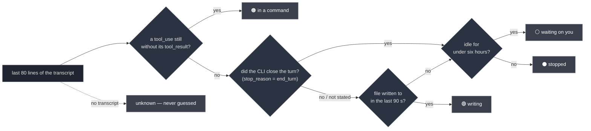

<div align="center">


# sereno

### Nine agent sessions open. Which one is stuck?

**A terminal UI that tells you what every coding-agent session is _actually_ doing — not just that it exists.**

One Python file · zero dependencies · Claude Code, Codex, Gemini, Antigravity

<br>

[](https://github.com/ElRaxy/sereno/actions/workflows/ci.yml)
[](https://github.com/ElRaxy/sereno/releases/latest)
[](https://www.python.org/)
[](#-install)
[](#-install)
[](LICENSE)

**English** · [Español](README.es.md)

<br>


</div>

```bash
brew install elraxy/tap/sereno
sereno
```

---

## Contents

- [Why](#-why)
- [The four states](#-the-four-states-and-why-theyre-hard)
- [Reading a row](#-reading-a-row)
- [Install](#-install)
- [Use](#-use)
- [Where the data comes from](#-where-the-data-comes-from)
- [What it does, and what it doesn't](#-what-it-does-and-what-it-deliberately-doesnt)
- [Privacy](#-privacy)
- [Requirements](#-requirements)
- [FAQ](#-faq)
- [Configuration](#-configuration)
- [Notes on the source](#-notes-on-the-source)
- [Contributing](#-contributing)
- [Credits](#-credits)

---

## 🌙 Why

A *sereno* was the night watchman who walked Spanish streets until the 1970s, carrying a
lantern and the keys to every door on his round. You slept; he checked. When something was
wrong, he was the one who knew.

Right now you have nine terminal tabs open. Two agents are mid-task. One has been blocked on
its own `pytest` for eleven minutes. One finished twenty minutes ago and is waiting for you.
One is eating 900 MB for a job you abandoned before lunch.

From the outside, all nine look identical. Finding out which is which means clicking through
all nine, reading the last screen of each, and losing your place.

**Session managers tell you the nine exist. `sereno` tells you what they are doing.**

---

## 🔎 The four states, and why they're hard

|  | what it means | why `ps` can't tell you |
|:--|:--|:--|
| 🟢 **writing** | producing an answer right now | — |
| 🟠 **in a command** | it issued a tool call and the result never came back | **this is the one that matters** |
| ⚪ **waiting on you** | it finished, nobody replied | looks identical to "it crashed" |
| ⚫ **stopped, waiting on you** | same, but over six hours ago | these are the ones worth closing |

An agent sitting in a three-minute `Bash` call **writes nothing to its transcript**, so by
file mtime it looks idle — and idle looks abandoned. `sereno` reads the tail of the transcript
and checks whether the last `tool_use` ever got its matching `tool_result`.

That single check is the difference between *"it hung"* and *"it's working, leave it alone"*.

The mtime lies the other way round too. It stays fresh for ninety seconds **after** the session
answers you — exactly the window in which you want to know which one is now waiting. So the
transcript is asked a second question: did the CLI close the turn? Pressing ESC counts as
closing it — a session you just interrupted is the one most clearly waiting on you.

Measured on 2026-08-28 against Claude Code's own spinner over nine live sessions, **16 of 48
samples reading `writing` were sessions that had already finished** — a third of them. None the other way round, so the
error had a direction: it hid the ones asking for you. With the turn check, the same bench gives
4 of 26.



To `ps`, all four are the same live process. The order matters too: **the tool check wins over
"is it writing"**, because a `tool_use` line was itself just written to the file, so both are
true at once and only the second one tells you anything.

> Every state is composed **in code** from typed facts read off the transcript — three booleans
> and a timestamp. No model is asked to summarise anything, so nothing can confidently tell
> you a session is fine when it isn't. When the facts are missing the row says `unknown`
> rather than picking the friendly answer.

---

## 📖 Reading a row

```
 ▎ ◐ Refactor payment webhooks  checkout-api ⎇feat/webhooks      now ▰▰▰▰▱  88% 512 MB
 │ │            │                    │            │               │     │     │     │
 │ │            │                    │            │               │     │     │     └ memory
 │ │            │                    │            │               │     │     └ % of the window
 │ │            │                    │            │               │     └ context used
 │ │            │                    │            │               └ idle time, by age
 │ │            │                    │            └ git branch
 │ │            │                    └ project
 │ │            └ title — the one Claude gave itself, or your /rename
 │ └ ◐ in a command · ● writing · nothing = waiting on you
 └ cursor. Turns yellow when the row is marked.
```

Between the state and the title there is one more column, and it carries two warnings: `⧉`,
another session is writing in the same place, and `↻`, this one is going in circles. When both
apply the clash wins the column — miss that one and two sessions can overwrite each other's
work; miss the other and you lose minutes. Both show in full in the panel and in `--list`.

And when the list **mixes CLIs**, one more: which one the session belongs to.

| | |
|---|---|
| `✦` | Claude Code |
| `◆` | Codex |
| `▲` | Gemini |
| `◇` | Antigravity |

It only appears when there is something to tell apart. Inside a single-CLI tab the column
disappears and the title gets those two back — repeating the same symbol down the whole list only
says what the active tab already said. The tab itself carries the glyph, so the bar is the legend.

**The title is the last thing to be cut.** Narrow the window and the support columns go first,
in this order: memory, then the project (which narrows before it goes), then the context bar.
The title keeps its width down to about 45 columns, because it is the one thing that tells two
sessions apart. Widening never takes a column away again, so resizing doesn't make the row
jump.

A column with nothing to say takes no space at all: no tmux means no memory column, and a
Codex tab means no context column, rather than eighteen blanks on every line.

The panel on the right shows that session's **last prompt and last reply**, so you can decide
whether to go back to it without opening it — plus the exact context figures (`176k / 200k`)
and the model.

### What it has been doing

The panel says what a session did last. What it does not say is the **path**, which is where
you see whether it is getting anywhere or going in circles. Under the prompt and the reply
there is a short trail of the last tool calls, each with how long it took and how it ended:

```
▸ what it has been doing  (+4 earlier)
  ! the same command has failed 3 times
  ·    2s  Read · tests/webhooks/test_retry.py
  ·    1s  Edit · src/webhooks/handler.py
  ✗   34s  Bash · pytest tests/webhooks -x -q
  ✗   31s  Bash · pytest tests/webhooks -x -q
  ✗   33s  Bash · pytest tests/webhooks -x -q
  ◐   12m  Bash · pytest tests/webhooks -x -q
```

`·` done · `✗` came back an error · `∅` a search that found nothing · `◐` still running, with
the clock ticking.

The two lines that start with `!` are the only judgements on the page, and neither is a guess:
they are counted, not sensed. **The same command failing three times in a row** is where a
person stops and looks; three is also the retry budget this project already uses everywhere
else. **Two searches in a row that find nothing** is the other one, and it is two and not three
on purpose — one failed retry can be a flake, but a second search that comes back empty already
says the question is wrong. Anything else in between resets the count: two empty greps with an
edit between them are work, not a sweep.

It costs no extra reading. The trail comes out of the same tail of the transcript the panel
already opens, and only for the row under the cursor — and the same two counts are computed for
every row on screen, out of the pass `sereno` already makes, which is what puts the `↻` in the
list without waiting for you to walk over to that row.

**Expect this to stay quiet.** Over 10,375 real tool calls from the twelve largest transcripts
on the machine this was built on, the loop warning fired on **zero** windows and the sweep on
**one**. That is not a bug and the thresholds were not loosened to produce a nicer number: when
a command fails, the next attempt is usually a slightly different command, so a literal
three-in-a-row is rare. A warning that shows up constantly is a warning you stop reading, and
the counts stay where the evidence put them.

Twenty minutes stuck on one call does **not** get a line of its own — `status` already says
that, and the same fact twice is not a second opinion. The trail shows it as what it is: a
glyph and a clock.

### Sessions that never started

A session whose replies never consumed a single token never got an answer, and resuming it hands you
its startup error and nothing else. Those sort below everything, print in grey, and are counted
apart in the header — `3 resumable · 1 never started`, not `4 resumable`.

It is worth the special case. On the machine this was written on, 21 of 39 history rows were like
that, 16 of them the same session relaunched in a loop and dying on `API Error: 401 · Please run
/login`. Having just died, they were the newest rows, so the default sort put them at the top of a
list whose entire purpose is telling you which session to go back to.

Two guards, both because a zero is not always a zero:

- Only once the transcript has been read whole. Half-read, zero means *not known yet*.
- **Never a live session.** One you just launched has not answered yet, and it is the row you most
  want to see.

### The ones born to be thrown away

On the machine this was written on, **46 of the 200 rows in the history were nobody's sessions**:
a skill optimiser running itself — twenty-two *"Score how well the response satisfies…"* and
twenty-two *"Complete the following task…"*. They took the real ones' place in the list, showed up
in `--hoy`, and put projects like `skillopt_sleep_claude_ylulwmwr` into `--disk`'s breakdown.

They are not detected by what they say — that would be guessing, and it would change with every
version of the script that launches them. They are detected by **where they were born**: their
working directory hangs off the system temp dir (`$TMPDIR`, `/tmp`, `/var/folders`…), a place
nobody resumes anything from because tomorrow it is gone.

- They are not offered for resuming, and they don't count as work in `--hoy`.
- `--disk` **does** report what they weigh, separately, the same way it does for subagents: their
  weight is real even if the work isn't yours.
- `--find` skips them **and says so** — *"(78 throwaway sessions from a temp dir not searched —
  add `--all`)"*. A search that stays quiet about what it skipped answers "never said" when the
  truth is "never looked". With `--all` it looks, because `--all` means look at everything.

**The price, stated plainly:** if you genuinely work inside `/tmp`, those sessions won't show up in
the list. It is a deliberate trade — the rare case gives way to the one that happens every day.

### Sessions with nowhere to go back to

A session whose working directory no longer exists cannot be returned to: resuming it drops you
into a `cd` to a place that is not there. Same treatment as the ones that never started — sorted
below everything, printed in grey, counted apart in the header.

It is the twin of the case above, asking the same question from the other side. Those never
answered; these answered plenty, and lost their destination.

On the machine this was written on it was **40 of the 46 history rows**. And that is not the freak
result of one odd afternoon: drop the 53 sessions an optimiser left behind that morning and it is
still **28 of 37**, in two very specific flavours — worktrees already deleted (10 of 15) and
temporary directories (18 of 18, every single one).

They are sunk, never hidden. A directory that is missing today may be a worktree you recreate or a
disk you remount, and the check is cached per path for 30 seconds, so the row comes back on its
own. Hiding them would trade one error for its opposite.

The cache stops the check repeating, and that is all it stops: the reload runs synchronously in the
loop that paints, so a hung network mount — where a `stat` never returns — freezes the list.
Measured with 1s of injected latency per `stat`: 37.4s for the first pass.

Two guards, both because a missing directory is not always a missing directory:

- **No path, no claim.** A session with no recorded `cwd` is never marked — flagging a row over a
  field that is absent is exactly the mistake this fixes.
- **Never a live session.** Its process is running inside that directory, so it exists by
  definition, and asking would spend a `stat` to confirm the obvious.

The fact is in `--json` too, as `cwd_exists`, so a statusline can filter for what is genuinely
resumable instead of guessing from the project name.

### About that context bar

It answers the question you currently answer by opening the session: *can this one take
another task, or is it about to compact?* The number is read from the transcript — every reply
records what it cost — so nothing is estimated and no API is called.

The **ceiling** is the one thing Claude Code does not write down. A session running the
one-million window still records itself as `claude-opus-5`, exactly like a 200k one. So sereno
works it out in this order, and stops at the first that answers:

1. `SERENO_CTX_MAX`, if you set it. You said it, it stands.
2. **What this session says.** First the `cost-state` line the CLI writes when it closes — its
   `modelUsage` is keyed by `claude-opus-5[1m]`, suffix included — and failing that, a `[1m]`
   suffix on the model in the transcript.
3. The `model` in your `~/.claude/settings.json`. That is the *machine*, not the session.
4. Otherwise, the standard window.
5. On top of all of 2–4, a guard: the ceiling can never end up below the context already seen.
   A session holding 560k is not on a 200k ceiling whoever says otherwise.

Rule 5 is what keeps the bar honest: the percentage can never read above 100%, and there is a
test that fails if it ever does.

**And that guard has memory: it looks at the peak too**, not just the context right now.
Compacting destroys the evidence — the window drops to 16k and a one-million session starts
being drawn against the standard one — so the peak is rebuilt from the transcript: the `usage`
of every reply and the `preTokens` of every compaction, which is context and not a running
total (checked against the preceding reply: median +0.4%, 165 of 169 within ±5%).

When the peak corrects, it corrects one way: a session read 171k against 200k — an **86%**,
"compact now" — when it was 171k of a million, a **17%**.

**Re-measured 2026-08-28, on 599 transcripts: it corrects zero.** Not because it broke — 301 of
those rows peak above 200k — but because step 3 already catches every one of them: this machine's
`~/.claude/settings.json` says `opus[1m]`, so nothing reaches the guard. It is the last line, not
a common path, and it only earns its keep on a machine whose settings do not say so. The first
measurement, on 524 transcripts, found 30 (5.7%).

Coverage on the same 599: `preTokens` in **115**, `cost-state` in **40** — the latter tripled from
13, so the suffix that names the window now arrives far more often than it used to.

#### The bar remembers where it has been

Compacting resets the number but not the session. A session on its 700th turn that has compacted
twice reads **11%** and looks like the freshest row on the list, right when it is the most worn
one — while an untouched session at 36% looks heavier than it is. That is backwards, and it is
the reading you use to decide whether a session takes another task or gets closed.

So the bar draws both. Filled cells in colour are what it holds **now**; filled cells in grey are
where it **has been**; hollow cells it has never reached.

```
▰▰▱▱▱   36%     never compacted — what you see is what it holds
▰▰▰▱▱   11%     compacted twice: it reached 52% before
```

The percentage is untouched — it is still the context of right now. Only the cells remember; a
peak that inflated the number would say the session is full, which is the opposite of true.

Two deliberate limits. The peak is `0` until the transcript has been read whole, and `0` draws
nothing: a session still loading shows the plain bar rather than a wrong one. And with no colour
in the terminal the grey cells are not drawn at all — the only thing separating "holds" from
"held" is the colour, and without it a fuller bar would simply lie upwards.

The peak comes from reading the whole transcript, and **the list now does that too**, a chunk per
refresh: see [Reading without blocking](#reading-without-blocking). And the opposite direction —
proving a session is *not* on the big window — has no evidence beyond `cost-state`. Re-checked
across all 599: **not one auto-compaction**, which would give away the threshold, and **not a
single `message.model` carrying the suffix**.

That first one is now checked properly rather than inferred: every compaction writes
`compactMetadata.trigger`, and all **182** of them on this machine say `manual`. A manual compact
happens whenever you ask for one, so its `preTokens` says what the session was holding — never
where the ceiling was.

**2 comes before 3, and it goes both ways.** Your global config is the weak one — a session
launched with a different `--model` does not obey it — so the one fact that describes *this*
session overrules it, raising the ceiling **and** lowering it. Before this order, a 200k session
on a machine configured for the big window was drawn against a million: 6% where 30% was due.

The lowering direction rests on a case not seen on the machine this was written on: of the 15
transcripts carrying `cost-state`, the 11 that name a main model name it with the suffix, and
the other four carry an empty `modelUsage`. Rule 5 bounds what can go wrong — dropping below
what has already been spent is impossible. The Haiku the CLI uses for titles is ignored when
reading that line, or a throwaway conversation would talk the ceiling down on its own.

---

## ⚡ Install

There is nothing to install, really. `sereno` is one Python file. Every route below ends with
that same file sitting somewhere on your `PATH`.

**With Homebrew**

```bash
brew install elraxy/tap/sereno
```

The only route that also **updates you**: `brew upgrade` brings the next version without you
having to hear that it exists.

**The one-liner**

```bash
curl -fsSL https://raw.githubusercontent.com/ElRaxy/sereno/main/install.sh | sh
```

**From the Releases page, no piping into a shell**

If you'd rather not pipe a script from the internet into `sh` — and you shouldn't, as a habit —
go to [**Releases**](https://github.com/ElRaxy/sereno/releases/latest), download the `sereno`
asset in your browser, and then:

```bash
chmod +x ~/Downloads/sereno && mv ~/Downloads/sereno ~/.local/bin/
```

Each release ships a `SHA256SUMS` file next to it. To check what you downloaded is what I
published:

```bash
cd ~/Downloads && shasum -a 256 -c SHA256SUMS      # sha256sum -c on Linux
```

**From the repository page**

Open [`sereno`](https://github.com/ElRaxy/sereno/blob/main/sereno) and use GitHub's download
button. It's the same file the installer fetches, at whatever `main` says today.

**With git, if you'd rather follow along**

```bash
git clone https://github.com/ElRaxy/sereno.git && ln -s "$PWD/sereno/sereno" ~/.local/bin/sereno
```

The symlink means `git pull` updates the command.

**Read the installer before running it**

```bash
curl -fsSLo /tmp/install.sh https://raw.githubusercontent.com/ElRaxy/sereno/main/install.sh
less /tmp/install.sh && sh /tmp/install.sh
```

It's 32 lines: it checks you have Python 3.8+, downloads one file into `~/.local/bin`, and
tells you if that directory isn't on your `PATH`. Set `SERENO_BIN` to put it elsewhere.

---

Python 3.8+ is the whole dependency list. No venv, no lock file, no supply chain. `scp` it to a
server and it runs there too. To uninstall, delete the file.

> **This used to say there would be no Homebrew formula, and the reason was a good one:** a
> formula is a second copy of the version number, and a copy a person maintains goes stale the
> week they forget it. What changed is not the opinion — it is that nobody writes that number any
> more. `release.sh` bumps the formula itself, and only **after** it has downloaded the published
> asset and checked that it is the program and that it reports the version being released, so the
> tap cannot point at something that was never verified. It lives at
> [**ElRaxy/homebrew-tap**](https://github.com/ElRaxy/homebrew-tap), has its own CI on macOS and
> Linux, and the formula checks the shebang and the version again before installing anything:
> v1.13.0 shipped an asset that was not the program, and GitHub releases are immutable, so that
> broken file is downloadable forever.

---

## 🕹 Use

```bash
sereno            # the picker
sereno --list     # plain list, touches nothing
sereno --json     # the same facts, for your statusline or your scripts
sereno --watch    # sit there and tell you the moment one stops and waits on you
sereno --find "the thing you half remember"
sereno --usage    # add what each session has burned
sereno --disk     # what the transcripts weigh, by project
sereno --now      # what every live session is running, all of them at once
sereno --help
```

### `--find`

For the session you know you had and cannot find. It searches **what was said** — your prompts
and the agent's replies — and prints the matches with enough of a line around them to
recognise, then opens the picker with only those, so `ENTER` puts you back inside.

```bash
sereno --find "webhook idempotency"
sereno --find "webhook idempotency" --all     # everything, not just the 200 most recent
```

Searching the raw files instead would have been three lines shorter and useless. Measured over
506 transcripts here: 287 files contained the word, 25 had it in something a human or the agent
actually said. The rest were `tool_result` dumps — greps, file contents, command output — and
the project's `CLAUDE.md`, which the CLI pastes into **every** session. With those in, any word
from your own project matches everywhere.

### `--watch`

Leave it in a spare pane. It says nothing until a session **stops working** — the transition
from writing (or running a command of its own) to waiting on you. Not "it is idle": most of
them are idle most of the time, and an alert you get every twenty seconds is one you stop
reading.

```bash
sereno --watch              # every 20s
sereno --watch --every 60
```

It reports four transitions, and only transitions: a session **stopping**, two sessions
**starting** to write in the same place, one **starting** to go in circles, and one **crossing**
a context threshold. Twenty minutes of the same loop is one line, not one per poll — and a
session that is already looping when you start `--watch` is part of the baseline, not news.

The fourth one is the only alert that is not about what a session is doing but about how much
room it has left to keep doing it, and the only one you answer by compacting rather than by
looking. It fires when a session crosses **80%** and again at **90%** of its context window —
at the crossing, not while it sits above it, so half an hour at 92% is one line. If the session
compacts, the level drops on its own and the next climb is news again. A session whose ceiling
is not known says nothing: `null` there means "not measured", never "full".

```bash
SERENO_CTX_AVISO=70,85 sereno --watch   # your own thresholds
SERENO_CTX_AVISO=0 sereno --watch       # no context alerts at all
```

You get a desktop notification (`osascript` on macOS, `notify-send` on Linux — both already on
your system) and a line on stdout, so it works over SSH and pipes fine. The first pass is
always silent: it only sets the baseline, otherwise starting it would announce everything you
already knew.

`--json` gives you every session with a stable `state`
(`writing` · `in_command` · `waiting` · `stopped` · `unknown`), its context figures, memory and
idle seconds. **It carries no conversation** — no prompt, no reply, nothing that was said. The
picker can show you that because you are looking at your own screen; a pipe cannot, so it
doesn't. A test fails if a field ever sneaks one in.

```bash
sereno --json | jq -r '.sessions[] | select(.state=="waiting") | .title'
sereno --json --all      # add the resumable history, the equivalent of pressing TAB
sereno --json | jq -r '.sessions[] | .session_id'   # to hand to `claude --resume`
```

**`schema` tells you whether your script still works.** The envelope carries `sereno` (the
program version) and `schema` (the contract version). They move for different reasons: `sereno`
goes up for a colour or a typo, `schema` only when a field is renamed, retyped or removed. A new
field does **not** bump it — nobody breaks by receiving more. So pin `schema`, not `sereno`: while
it reads `1`, a script written today keeps reading the same fields. A test refuses to let a field
disappear without the number moving with it.

**`id` and `session_id` are not the same thing, and it is worth knowing which you want.** `id` is
the **row key**: the tmux session name for a live one (`cc-VanguardIA-90a6fb95`) and the uuid for
one from history — good for matching rows across two calls. `session_id` is the **Claude session
id**, the one `--resume` takes, and it is `null` when the row belongs to another CLI. They were
mixed into one field until 1.10.0, and in the picker that meant the copy key handed you a tmux
name that resumed nothing.

<details>
<summary><strong>Three things worth wiring it into</strong></summary>

<br>

**A shell prompt that says how many are waiting on you.** Cheap enough to run on every prompt,
and silent when the answer is zero:

```bash
sereno_wait() {
  local n
  n=$(sereno --json 2>/dev/null | jq '[.sessions[] | select(.state=="waiting")] | length')
  [ "${n:-0}" -gt 0 ] && printf ' ⏳%s' "$n"
}
PS1='$(sereno_wait) \w $ '
```

**A tmux status bar with the session closest to compacting.** The one you want to know about is
the one running out of window, not the one using the most memory:

```bash
# .tmux.conf
set -g status-right '#(sereno --json | jq -r "[.sessions[] | select(.context_max>0)] \
  | max_by(.context_tokens/.context_max) \
  | \"\(.title[0:24]) \(.context_tokens*100/.context_max | floor)%\"") '
```

**Anything that needs to wait for an agent to finish.** `state` is a closed enum, so this is a
loop and not a guess:

```bash
until [ "$(sereno --json | jq -r '.sessions[] | select(.id=="'"$id"'") | .state')" = waiting ]; do
  sleep 20
done
say "it wants you"
```

Every field is typed and every state comes from that same enum, so nothing here has to parse
prose. `context_max` is `null` when the ceiling is unknown, which is why the tmux line filters
on it first.

</details>

| key | |
|:--|:--|
| `↑` `↓` / `j` `k` | move |
| `ENTER` | open it |
| `SPACE` | mark · `v` a range · `a` all · `i` invert · `d` everything idle over an hour |
| `r` | open the marked ones, all at once — it asks where, if there is more than one place |
| `c` | hand the marked ones over to another CLI — it asks which, where to open them, and remembers |
| `n` | what they are **all** running, in one screen |
| `x` | close the marked ones — asks first, and warns if any is mid-task; what you close stays closed |
| `s` / `S` | sort by activity · context · project · memory · **spend** / invert |
| `y` | copy the session id, the one `claude --resume` takes (or click it — see below) |
| `/` | filter by title as you type |
| `TAB` | switch CLI: Claude · Codex · Gemini · all — each row carries its CLI's glyph when the list mixes them |
| `?` | everything else |

**The mouse works.** Click to select, double click to open, right click (or the bar on the
left edge) to mark, wheel to scroll. The tabs at the top and the buttons along the bottom are
real buttons.

**And underlined values copy when you click them.** While sereno is running you cannot
drag-select with the mouse — mouse reporting is on, so the terminal hands the drag to the app —
so the values you were going to retype are a click instead: the project, the session id, and the
headers of *what you last said* and *what it last replied*, which copy the whole text and not the
part that fitted. It goes through OSC 52, which needs no extra program and survives SSH; the
status line always says what actually landed on the clipboard.

Two of them copy something you cannot read on screen, on purpose: `project` shows
`docs-site · main` and copies `/Users/you/code/docs-site`, and the reply header copies the reply
whole. A click that copied what was painted would hand you back what you had just finished
reading.

Nothing drops you out of the picker. Closing four sessions and opening a fifth is one visit,
not five.

### `--usage`

The context bar says how full the window is **right now**. It does not say how much a session
has burned: one that has compacted three times reads 20% with twelve hours inside it. `--usage`
adds that — tokens in and out, cache read, how many replies, how many compactions, the peak
context it reached, and the
minutes actually spent working.

```bash
sereno --list --usage
sereno --json --usage | jq -r '.sessions[] | "\(.title)  \(.output_tokens) out"'
```

It is off by default because the figure lives all over the transcript: the tail is no use, the
whole file has to be read. Measured here, that is 0.11 ms for the median transcript and 223 ms
for the largest on disk (89 MB) — fine when you ask for it, wrong for a statusline that runs
every few seconds. In the picker it costs nothing extra: it is read for the row under the
cursor, like the rest of the panel, and cached.

#### Reading without blocking

In the picker that read is not done in one go. Every turn of the loop — every keystroke and every
2.5 s — spends a budget of **25 ms** reading whatever is still missing, starting with the row you
are looking at and staying with it until it is finished. A partial read shows as one: while
anything is missing the panel prints "reading…" instead of a figure, because half a read gives
half a figure, and in a column headed "spend" that reads as the total.

Measured over the 40 sessions on this machine: **345 ms in a single turn** before, and now 12
turns of **38 ms at most** (the budget is checked after each row, so one turn can overshoot by
whatever a single row costs). With everything read, the turn costs 0.002 ms. The largest
transcript on disk went from one 120 ms stretch to four turns.

The **peak** is the exception, and it is used even when the read is partial: it can only grow, so
a partial falls short but never overshoots. On the 89 MB transcript it crosses 200k on the first
turn, so the bar corrects itself almost at once. **Sorting by spend** admits no partials, on the
other hand — it would sort by what has been read rather than by what was spent — so a half-read
row waits at the bottom and moves up once, when it finishes.

Four figures, and **no total**. Cache read is not new material — it is what was already sent
being read again — and it runs a hundred times larger than everything else put together (300M
against 3M in an eight-hour session). Adding it to the input gives a huge number that means
nothing, so the four parts stay apart and whoever wants a total composes it knowing what they
are adding.

**What it does not count**, and this matters if you delegate: subagent turns and the Haiku calls
the CLI makes on its own (titles, summaries) leave no line in the transcript. Cross-checked
against the `cost-state` the CLI itself writes, the scan matches within 0.1% on five transcripts
of eight and falls up to 21% short on two. The fields are called `input_tokens` / `output_tokens`
— what the transcript recorded — not "what you were charged", which is a different thing.

That other thing travels apart, as `api_cost_usd` in `--json --usage` only: the `totalCostUSD`
the CLI wrote with its own prices, relayed as-is. `sereno` carries no price table — one in a
public repo goes stale without telling anyone — and it never puts a dollar figure in the TUI,
where on a subscription plan it would be money you did not pay.

#### Sorting by what it burned

`s` cycles the modes and the fifth one is **spend**: the heaviest first, new input plus output.
It is the only one of the five that sorts on something it has to go and read, so it reads once,
when you enter the mode — 94 ms for the 8 live sessions on this machine and 389 ms for the 40 in
history the first time, then nothing.

It is not the context bar under another name, and the case above is what separates them:
**compacting empties the window and does not give back what was already spent**. Measured here
across 40 sessions, the three that had compacted ranked 2nd, 3rd and 4th by spend and 5th, 7th
and 8th by context. Against *activity* there is no resemblance at all (rho 0.13): that one sorts
by recent, not by accumulated.

Which figure you pick barely matters — `out`, `input+output` and `cache read` correlate at
rho ≥ 0.98 with each other across those 40 transcripts and share the same top 5 — so it takes the
one that fits in a line. Money is out for a different reason: `totalCostUSD` is only written by
the CLI **on exit**, so it was present in 16 of 40 sessions and in **none** of the live ones.

You can leave it on: `SERENO_SORT=spend`, or `-spend` to invert it.

### `c` — handing a session to another CLI

**This is a handover, not a migration, and it cannot be anything else.** A Claude session's
context lives in its own transcript, with its own tool-call ids; there is no format that another
CLI can pick up and continue. What `c` does is open a **new** session of the other CLI, standing
in the same directory and branch, with a briefing of where the Claude one got to:

```
You are taking over from a Claude Code session. You do not have its history:
what follows is everything that is known about it.

  project: /Users/you/code/checkout-api
  branch: feat/webhooks
  title: Refactor payment webhooks
  state: in a command

  its last tool calls:
    ·   2s  Read · tests/webhooks/test_retry.py
    ✗  34s  Bash · pytest tests/webhooks -x -q
    ◐   1m  Bash · pytest tests/webhooks -x -q

Get your bearings in that directory before touching anything.
```

Facts only. **No prompt and no reply of yours goes in there**, and that is not squeamishness: the
briefing travels inside Warp's launch configuration, which stays on disk in
`~/.warp/launch_configurations/`. Putting a client's conversation in a file is a decision, so it
is asked for and never the default. `SERENO_RELEVO=completo` sets it, and `k` in the box below
toggles it for one handover — an environment variable is not a way to offer something.

`c` opens that box rather than launching straight away:

```
Hand over 3 sessions to:

· Refactor payment webhooks
· Fix flaky login test
· Migrate CI to reusable workflows

[1] codex   [2] claude
    gemini, antigravity — not checked how to seed it
[k] include the conversation: no
[w] open them in: tmux

[1-9] hand over    [any other key] cancel
```

The CLI the rows come from is not offered — but only when it is the origin of **every** marked
row: with a mixed selection both appear, because some row can go to each. Any other key cancels.

`w` cycles where the windows open, the same question `r` asks. The **last destination goes to the
front and the last place stays put**: whoever hands over to Codex once hands over to Codex always,
and starting from the top of the list every time is making them type the same thing again.

The CLIs that **cannot** be offered are listed greyed out rather than hidden — with only one
installed there is otherwise no way to find out this works with more. They are grouped by their
own reason, and the two are not the same: *not installed* is fixed by installing it, *not checked
how to seed it* needs someone to confirm in that CLI's `--help` how a starting prompt is passed.
That is the rule that keeps `gemini` out of the table, not an oversight.

A session whose directory no longer exists is **left out** rather than started in `~`: a handover
that begins in the wrong place looks like it worked. The check asks for an **absolute** path, not
just for one that exists — `Path("").is_dir()` is `True` in Python, because it reads the empty
path as `.`, so a row with no recorded directory used to sail through the guard and open the CLI
wherever the process happened to be standing, reporting one handed over.

**It goes both ways.** A Codex session is handed to Claude the same way a Claude one is handed to
Codex, and the briefing says which of the two it is coming from rather than always naming Claude.
With nothing chosen, the destination is whichever available CLI is **not** the one the rows came
from — which is also why nothing hands a session to the program it is already running under:
Codex to Codex opened a blank session and counted it as a handover.

For that to mean anything, a Codex row had to know where it lives. Its index carries only
`{id, thread_name, updated_at}`, so the directory is read from the header of its rollout
(`payload.cwd`) — only for the rows about to be drawn, and only their first line. One without a
readable rollout keeps an empty directory rather than inheriting a neighbour's, and is left out
of the handover like any other row with nowhere to stand.

Only CLIs that are actually on your `PATH` are offered. Today the table has `codex`
(`codex [PROMPT]`) and `claude` (`claude [PROMPT]`), both of which start an interactive session
with a seed, checked against their own `--help`; adding another is one line, but its flag has to
be verified first rather than guessed — which is why `gemini` is not in there.

### `--now`

The panel already draws the trail of tool calls of the session under the cursor — with its
timer, its failures and its stuck-detection. **Of the session under the cursor.** Finding out
what nine sessions are doing meant moving the cursor down nine times, so in practice you went
back to attaching to each one. This is that same trail, for all of them, in one screen:

```
4 live · 2 working, 2 waiting on you

Refactor payment webhooks  ·  checkout-api                  in a command
  ! the same command has failed 3 times
    ✗  31s  Bash · pytest tests/webhooks -x -q
    ✗  33s  Bash · pytest tests/webhooks -x -q
    ◐   1m  Bash · pytest tests/webhooks -x -q

Fix flaky login test  ·  checkout-api                       writing
  ! 2 searches in a row with no result
    ·   1s  Edit · tests/test_login.py
    ✗   1s  Bash · rg -n freeze_time tests/
    ✗   1s  Bash · rg -n 'clock|monotonic' tests/

Draft release notes v2.4  ·  docs-site                      waiting on you · 7m ago
    ·   3s  Bash · git log --oneline v2.3..HEAD
    ·   1s  Write · NOTES.md

Migrate CI to reusable workflows  ·  infra                  waiting on you · 2h ago
  ! the same command has failed 3 times
    ✗  12s  Bash · act -j build --dryrun
    ✗  11s  Bash · act -j build --dryrun
    ✗  12s  Bash · act -j build --dryrun
```

Same reading as the panel, same facts, no extra file opened per row beyond the tail each one
already needs. **`n` shows the same thing without leaving the picker** — one composer builds both, so the screen and the terminal cannot end up saying different things about the same facts. The header cannot drift from the rows underneath: it is counted from them, and a
test fails if the two ever disagree.

### `--hoy`

The nine-o-clock question: **what did today add up to**. `--now` is the snapshot of this instant
and `--disk` the accumulated weight; neither answers this one. (`--today` works too.)

```
Today · since 05:00 · 5 sessions in 4 projects
  first at 10:07, last at 10:42

by project
  VanguardIA                   4         now
  sereno                       1         now

still open
  ● Mejora continua de Sereno              sereno          writing                now   47%
  ● Shopify store                          VanguardIA      writing                now   33%
  ○ Warp error review                      VanguardIA      waiting on you     37m ago   14%
```

**The day starts at five in the morning, not at midnight.** Someone closing at half past one is
asking about the work they just did, and a midnight cutoff would answer *"nothing touched today"*
exactly when they look hardest — a bug that reads as a plausible answer rather than an error.
`SERENO_JORNADA=7` moves the hour.

It is cheap because the `mtime` filter runs **before** anything is opened: out of 877 transcripts,
a normal day touches fewer than twenty. **`--hoy --usage`** adds what each project burned — replies
and active time — and that does read whole transcripts:

```
  VanguardIA                         2         now   89 replies · 37m
  sereno                             1         now   177 replies · 1h 01m
```

In *still open* the order is the point, not the disk clock: what is still running on top, what
is waiting on you below it, most recent first. The project column only shows up if the day touched
more than one, and the title width comes from the longest one about to be printed.

Without `--usage` those fields are `null` and **not zero**: nobody measured them, and a zero there
would read as "did no work". *Still open* uses the same cutoff as the list (`estado_estable`:
waiting on you up to six hours, stopped after), not one of its own — two thresholds would give two
different answers to the same question depending on where you looked.

### `--disk`

What the transcripts weigh, and where that weight is. The panel gives the size of the row under
the cursor and nothing else, so the split was invisible — and on the machine this was written on it
turned out to be **3.4 GB across 595 sessions**, with 3,464 MB of it in a single project and
**403 MB in five sessions**.

```
3.4 GB in 595 sessions · /Users/you/.claude/projects
  plus 285 subagent transcripts, 436 KB

by project
  VanguardIA                       442      3.4 GB
  and 56 more projects, 3.8 MB between them

the heaviest sessions
     85.2 MB  25d ago  Rebuild the atelier landing page       445cdc22
     84.9 MB  20d ago  Continue with the atelier              68e64cae
     …

102 of them (2.9 MB) have no place to go back to.

what you would get back, by how long untouched
  over 7d          337      2.5 GB
  over 30d         210      1.9 GB
  over 90d          95    788.0 MB
  each tier includes the ones below · deleting a transcript takes that session out of --resume for good
```

**The total tells you what it occupies; the last block tells you what you would get back.** Those
are different questions, and only the second one is ever the reason you ran this. The tiers are
nested — what is over 90 days is inside what is over 30 — so they read as "and if I push a little
further, how much more", and adding them up would count the same session twice. Only tiers with
something in them are printed: a machine with years of history sees four lines, a fresh one sees
one. A session whose date could not be read counts in **none** of them; a file that vanished
between two `stat` calls is not evidence that it is old.

It **does not delete anything, does not offer to, and calls nothing garbage.** `sereno` writes to
nothing that belongs to a session, and a heavy history is not a problem — it is a fact you decide
what to do with. Reading it costs 340ms for 595 sessions: a `stat` on each, the `cwd` from the
header of each, and the title only of the handful it prints.

Subagent transcripts (`agent-*.jsonl`) are counted apart: 285 files and 436 KB here, so folding
them into the per-project split would have moved the file count without moving a megabyte.

### `--dismiss` — empty the registry of what no longer runs

The launcher registry (`~/.claude/warp-sessions/live/`) keeps one entry per session, and the ones
whose process died stay there: those are the **orphans** the picker offers to resume. When you no
longer want them offered, `--dismiss` archives every entry **whose process is gone** in one go,
without touching a live one.

```bash
sereno --dismiss
# Discarded 11 entries.
```

**It doesn't delete: it moves.** Entries go to `~/.claude/warp-sessions/dismissed/<date>/`, so
undoing it is an `mv`. And it never touches the transcript: the conversation stays in
`~/.claude/projects` and the session is still resumable from the history (TAB in the picker, or
`claude --resume <id>`). All you lose is being offered it again when you open a terminal.

Until 1.30.2 this flag did nothing if you had a session open — see the CHANGELOG.

### 🎭 Try it without touching your data

```bash
sereno --demo          # or SERENO_DEMO=1 sereno
```

Invented sessions, invented projects. **Use this for anything you publish.** The detail panel
shows real prompts and real replies, so a screenshot of a session manager is an unusually
efficient way to leak a client's work — the first take of the GIF above went out with customer
names in it, which is why demo mode and a test that guards it both exist.

### 🔔 One line when you open a terminal

```bash
# ~/.zshrc or ~/.bashrc
sereno --hook
```

Prints one line when something is running, and absolutely nothing when there isn't.

---

## 💾 Where the data comes from

Claude Code already writes everything, in `~/.claude/projects/<project>/<uuid>.jsonl`: one line
of JSON per event, appended as the session runs. `sereno` reads the **last 80 lines** of at most
40 of those files and derives everything from them. Nothing else exists — no config file, no
daemon, no index, no telemetry, no API call. Install it and it already knows about every session
you have ever run.

| what it reads | what it gets out of it |
|:--|:--|
| the file's mtime, and the turn's `stop_reason` | is it writing right now |
| the last `tool_use` / `tool_result` pair | is it stuck inside a command |
| `message.usage` on the last reply | context spent, and the model |
| `cwd`, `gitBranch` | project and branch |
| `aiTitle`, `lastPrompt` | the title and the panel |

That costs **4 ms** for the live sessions and **16 ms** for the whole history, measured against
1,248 transcripts and 3.8 GB. The results are cached by mtime, so a file that hasn't moved isn't
read twice.

Codex, Gemini and Antigravity come from their own history directories and reopen with their own
`resume` command. They are files on disk, not live processes, so `sereno` refuses to "close" them
rather than pretending it did something.

<details>
<summary><strong>Optional: tmux and Warp</strong></summary>

<br>

If your sessions run inside tmux you also get live memory per session, which ones already have a
terminal attached, and the ability to actually kill them. On macOS with Warp, `ENTER` opens a
session in a **new window** instead of taking over the one you're reading.

Both optional. Without them everything works except the memory column — which then takes no space
at all, rather than sitting there empty — and `ENTER` execs into the session in the current
terminal.

**Several at once** — `r` and `c` open a window per session — goes through one of these. `r`
asks which, when more than one is around; with a single one there is nothing to choose and no box
appears. `SERENO_LANZADOR` pins one:

| | what it opens | needs |
|---|---|---|
| **Warp** | a real window per session | macOS with Warp installed |
| **iTerm2** | an iTerm2 window per session | macOS with iTerm2 installed |
| **kitty** | a kitty window per session, with its title and its directory | macOS with kitty installed |
| **tmux** | a tmux window per session, in the session you are already in | being *inside* tmux — the only one that works off macOS |
| **Terminal.app** | a Terminal window per session | macOS |

Terminal.app goes last on purpose: macOS **restores** its windows on reboot, so a day of
handovers leaves windows coming back at you at startup. iTerm2 comes before kitty because it
reuses its process: kitty is launched with `open -n` and spends one instance per window.

That `-n` is not an oversight. With `--single-instance` the second and third calls are swallowed
by the instance already running and **`open` returns 0 for all three while opening a single
window** — an `open` that exits fine does not prove anything happened. And it goes through `open`
rather than calling `kitty` directly because that way it stays in the foreground until its command
finishes, which would block the whole picker for as long as a session is open.

**gnome-terminal** is not there, and that is not an oversight either: launchers in this program
are not added by eye. The exact way to ask for a window with a command inside is measured first —
as it was for all five, one at a time — and that needs a Linux machine with a desktop.

VS Code is **not** in there, and that is a measured decision rather than an oversight: it has no
way to run a command in its integrated terminal from outside. The one route that exists — a task
with `runOn: folderOpen` in a temporary workspace — did not fire, with a fresh folder or with one
VS Code already knew. Opening the folder without attaching the session would be the kind of half
truth this program exists not to tell.

With none of them, `r` and `c` say so and stop, rather than announcing tabs nobody opened — which
is what they did until 1.24.0, when they did not crash outright: `open` is a macOS command, and
on Linux the call raised.

For the four that are not Warp the command travels in a **script on disk** rather than inline:
`do script`, `create window ... command` and `tmux new-window` take the order as one string, and a
handover briefing has
newlines and quotes in it — inline is the same bug that used to break Warp's YAML, wearing a
different suit. The script `cd`s to the session's directory (and **aborts** if it is gone rather
than carrying on in `~`), unsets `TMUX` (reattaching is `tmux attach`, which inside tmux refuses
with *sessions should be nested with care*), and **deletes itself before the exec** — a deleted
file is still readable through the descriptor `sh` already holds, so the rest runs anyway and the
briefing does not stay on disk. It lives in `~/.sereno/lanzar`, `0700`, not in `/tmp`.

</details>

---

## 📊 What it does, and what it deliberately doesn't

Almost everything else in this space **launches and orchestrates** sessions: it starts the agents,
so it knows about them because it made them. `sereno` starts nothing. It reads what the CLIs
already wrote, which is why it sees sessions you opened last month, from a terminal it has never
heard of, on a machine you're SSH'd into.

**It will never:**

- **launch or orchestrate agents.** That's the whole crowded half of this space, and the half
  that has to own your workflow to work at all. Use one of those to spawn a fleet, then use this
  to see what the fleet is doing.
- **write to a transcript, or to anything that belongs to a session.** It kills processes you
  pick, and that's the only destructive thing in it.
- **send anything anywhere.** There is no networking code at all, and a test in CI fails the
  build if any appears.
- **ask a model what it thinks.** Every state is composed in code from typed facts.

What that buys you, concretely:

|  | sereno | launchers and session managers | desktop apps |
|:--|:--:|:--:|:--:|
| Sees sessions it didn't start | ✅ | ❌ | 🟡 |
| Live per-session state | ✅ | ❌ | 🟡 |
| Last prompt + last reply | ✅ | ❌ | 🟡 |
| Context spent per session | ✅ | ❌ | ❌ |
| Works with zero setup | ✅ | needs its launcher | needs install |
| Codex / Gemini too | ✅ | Claude only | Claude only |
| Runs over SSH | ✅ | ✅ | ❌ |
| Dependencies | **none** | tmux | Electron / Swift |

---

## 🔒 Privacy

It reads your prompts and your agent's replies to draw them on your screen. That deserves a
straight answer, not a promise:

**`sereno` has zero networking code.** No `socket`, no `urllib`, no `requests` — the whole
import list is `base64, os, stat, sys, json, re, shlex, shutil, subprocess, time,
datetime, pathlib, unicodedata, uuid` and `curses`. Nothing it reads can leave your machine, because there is nothing
in it that can send anything anywhere.

The only external programs it ever runs are `ps` (memory), `tmux` (list and kill sessions, and
open a window per session), `open` (hand a session to Warp), `osascript` (a Terminal.app window
per session, and — under `--watch` — the desktop alert), `defaults` (read your macOS locale) and
`notify-send` for that same alert off macOS. No telemetry, no analytics, no
update check, nothing phoning home.

One thing worth saying plainly: a `--watch` alert puts the **session title** into your system's
notification centre, which on a shared or screen-shared machine is a place you may not want it.
The alert carries the title and the project, never the conversation.

`tests/test_sin_red.py` walks the AST on every CI run and fails if a networking import appears,
or if a new external binary shows up that isn't on that list. You don't have to take my word
for it — the test *is* the word.

[`SECURITY.md`](SECURITY.md) has the full list of what it reads, what it writes and what it
runs, and it's where to report anything exploitable.

---

## ✅ Requirements

| | |
|:--|:--|
| **macOS** | works, and it's where it was built |
| **Linux** | works — CI runs the real TUI in a pty on Ubuntu, and opens tabs by calling tmux for real, which is the only route there |
| **Windows** | no. `curses` isn't in the Python standard library there. **WSL is fine** |
| **Python** | 3.8 or newer, no packages |
| **Terminal** | any. Uses 256 colours when available, degrades cleanly when not |

---

## 🩺 FAQ

<details>
<summary><strong>I installed it and it shows nothing</strong></summary>

<br>

Check `ls ~/.claude/projects` — that's the only thing it needs. If the folder is empty you
haven't run Claude Code on this machine (or `$HOME` isn't what you think, which happens under
`sudo`).

If it lists sessions but the ones you expected are missing, they're probably in the
**`history`** tab rather than `claude`: anything whose transcript hasn't moved in 90 seconds
counts as resumable, not live. Press `TAB`.

</details>

<details>
<summary><strong>`x` says "history, not processes: nothing to close"</strong></summary>

<br>

Correct, and deliberate. Without tmux there's no process to kill — the session is a file on
disk. `sereno` refuses instead of pretending it did something. Use `ENTER` to resume it, or
delete the transcript yourself if you want it gone.

</details>

<details>
<summary><strong>The memory column is empty</strong></summary>

<br>

Memory is per-process, and it only knows the process if the session runs inside tmux under the
socket it watches (`SERENO_TMUX_SOCK`, default `claude-code`). Everything else still works.

</details>

<details>
<summary><strong>Does it slow anything down? Does it touch my sessions?</strong></summary>

<br>

It reads the **tail** of at most 40 transcripts and caches by mtime — 4 ms for the live ones,
16 ms for the full history, measured against 1.248 transcripts and 3,8 GB. It never writes to a
transcript. The only thing it ever writes is a Warp launch file, and only when you press
`ENTER` on a machine that has Warp.

</details>

<details>
<summary><strong>How do I uninstall it?</strong></summary>

<br>

```bash
rm ~/.local/bin/sereno
```

That's it. It creates no config, no cache and no state directory of its own.

</details>

---

## 🔧 Configuration

There is no config file. Everything is an environment variable, so nothing about it survives
you deleting the script.

| Variable | Default | |
|:--|:--|:--|
| `SERENO_LANG` | your locale | `en` or `es`. On macOS it reads `AppleLocale` |
| `SERENO_DEMO` | off | `1` for invented sessions. Set it before any screenshot |
| `SERENO_CTX_MAX` | worked out | context ceiling in tokens, when the cascade gets it wrong |
| `SERENO_CTX_AVISO` | `80,90` | the percentages `--watch` alerts on. `0` turns the context alert off |
| `SERENO_SORT` | `activity` | which sort the picker opens on: `context`, `project`, `memory`, `spend`. A `-` in front inverts it |
| `SERENO_TMUX_SOCK` | `claude-code` | which tmux socket to read |
| `SERENO_REGISTRY` | `~/.claude/warp-sessions` | where the optional launcher registry lives |
| `SERENO_BIN` | `~/.local/bin` | where `install.sh` puts the file |
| `SERENO_DEBUG` | off | `1` stops the picker swallowing a curses error. Use it if it
  exits without saying why |

```bash
# a one-million window, in English, without touching anything permanent
SERENO_CTX_MAX=1000000 SERENO_LANG=en sereno
```

---

## 🧠 Notes on the source

One file, about 3,200 lines, standard library only.

**The comments are in Spanish.** They explain *why* each decision is the way it is, usually
naming the incident that caused it, and translating that would flatten it into generic prose.
The interface is bilingual; the reasoning is in the author's language. Issues and PRs in
English are very welcome.

<details>
<summary><strong>Three decisions worth knowing about</strong></summary>

<br>

**The cursor row changes background, not video.** `A_REVERSE` repaints the whole row white and
throws away the colour of every column — the state, the project, the memory — on the one row
you're actually looking at.

**Mouse events are parsed by hand.** The ncurses that ships with macOS is 6.0 from **2015** and
only speaks the 1988 x11 mouse protocol, where the column travels in a single byte and dies at
column 223. On a wide window, clicks in the right-hand panel land somewhere else entirely.
`sereno` requests SGR and parses it itself, while still accepting `KEY_MOUSE` from a modern
ncurses.

**`agent-*.jsonl` are not sessions.** Claude Code drops its subagent transcripts next to the
real ones — 213 against 1.035 on the machine this was built on. They aren't resumable and have
no title of their own, so the list drowned under twenty copies of the same subagent prompt
until they were filtered out.

</details>

---

Changes between versions are in [CHANGELOG.md](CHANGELOG.md).

## 🤝 Contributing

Issues and pull requests welcome, in English or Spanish. The short, actionable version of this
section is [CONTRIBUTING.md](CONTRIBUTING.md). Run the tests before you open one:

```bash
python3 tests/todos.py
```

That is the same entry point CI uses, so there is no hand-written list to fall out of sync: it
collects the whole folder, prints a line per file and ends with the count. There are sixty-two
today, and CI runs every one of them on macOS and Ubuntu across Python 3.8, 3.12 and 3.13. Most
guard against something that fails **silently**, which is why they exist at all:

- **`test_demo_aislado.py`** — demo mode must not return a single row that came from real disk.
  Plants a canary in a fake `HOME` and walks every function that reads data.
- **`test_i18n.py`** — every string printed goes through `_()` and has a Spanish entry with the
  same `{placeholders}`. It walks the AST, so a hardcoded phrase is caught too. English is the
  key, so a missing translation never crashes; it just quietly shows the wrong language.
- **`test_sin_red.py`** — no sockets, and no external binary beyond the declared list.
- **`test_contexto.py`** — the context bar can never read above 100%.
- **`test_json_sin_conversacion.py`** — `--json` carries no prompt and no reply.
- **`test_uso.py`** — three lines of the same reply count once, cache read never joins the
  input, and reading only what is new gives exactly what reading the whole file gives.
- **`test_recorrido.py`** — a loop is three failures of the *same* command, a sweep is two
  empty searches in a row, and nothing unobserved ever counts as success.
- **`test_panel_geometria.py`** — the terminal is replaced by a stand-in that records every
  write, so no cell gets painted twice and nothing spills out of the frame.
- **`test_orden_en_pantalla.py`** — the sort key reaches `spend`, the list is painted in that
  order, and a half-read row shows "reading…" rather than a figure. With the rows EMPTIED of
  usage: the demo ships it precooked, and with it in place the test passed even without the
  wiring it claims to cover.
- **`test_nombre_e_id.py`** — the title is cut at the first sentence, two sessions sharing a
  name are separated by their short id, and the id shown and copied is the Claude session id
  rather than the tmux session name.
- **`test_copiar_del_panel.py`** — the underlined values copy, and they copy the right thing:
  `project` hands over the full path and not the `docs-site · main` it paints, the reply header
  hands over the reply and not itself, and a field with nothing worth pasting neither underlines
  nor reacts. The stand-in records attributes as well as characters, so the *visible* half — the
  underline — is checked too; colour still can't be, since colour pairs are 0 in the stand-in.
- **`test_release_guardas.py`** — `release.sh` refuses to publish something that isn't the
  program. It runs the script against throwaway repos rather than reading its conditions, which
  is the only reason it caught the script aborting **silently** on a broken extraction.
- **`test_suelo_38.py`** — nothing uses syntax newer than 3.8. The CI already runs on 3.8,
  but it tells you late: whoever wrote the line has 3.12 and it compiles fine there.
- Plus the TUI booting in a pty, `--watch` firing on the edge, `--find` reading only speech,
  unknown flags being reported, and a resumed session being followed to its live transcript.

House rules:

- **A test you haven't seen fail doesn't count.** Break the code on purpose, watch it go red,
  then fix it. Half the tests here were written that way after the first version passed
  something it shouldn't have. Since 1.33.0 that ritual is a test of its own:
  `tests/test_mutantes.py` breaks one hundred and nine real guards, one at a time, on a copy of the
  tree, and
  fails if any of them survives — or if an anchor no longer exists, which means the catalogue
  went stale and the entry has to be rewritten rather than quietly skipped.
- **A test that isn't wired in doesn't count either.** The CI runs `tests/todos.py`, which
  collects the whole folder — there is no hand-written list to forget. There used to be one, and
  an audit found seventeen of forty-four files never ran while the checks stayed green.
- **GitHub Actions are pinned by commit SHA**, and the repository enforces it, so a workflow
  edit using `@v4` will be rejected. Dependabot raises the bumps.
- **Releases go through `./release.sh <version>`, never by hand** — see below.

### Releasing

```bash
# 1. bump VERSION in `sereno` and add the section to CHANGELOG.md, in a PR
# 2. once it is on main:
./release.sh 1.14.0
```

That is the whole procedure, and it is a script rather than a list of commands for a reason.
It used to be a list, and one of its lines was `git show $SHA:sereno > /tmp/rel/sereno`. **Under
zsh that extracts nothing**: `$SHA:sereno` begins with `:s`, the substitution modifier, so the
shell eats the suffix and the command becomes `git show <sha>` — which prints the commit log. No
error, exit 0. **v1.13.0 shipped that log as its binary**, and GitHub releases are immutable, so
it could not be replaced.

The trap only springs when the path begins with `s`, and the file here is called `sereno`. So the
script does what a written procedure cannot: it **refuses to publish** if what it extracted does
not begin with the shebang or does not report the version being released, and it **re-downloads**
the published asset and compares before saying OK. `tests/test_release_guardas.py` runs it against
throwaway repos and checks it aborts, says why, and leaves no tag behind.

After that — and only after it — `release.sh` calls `./bump-tap.sh`, which points the Homebrew
formula at the version just verified. Separate script for a concrete reason: inside `release.sh` it
would live behind `gh release create`, so testing it would mean publishing a real release. On its
own it is exercised end to end against a throwaway remote by `tests/test_bump_tap.py`, which
clones, edits, **pushes and re-reads from the remote**, without touching the network. If the tap
step fails, the message says so **without calling it a failure**: the release is published and
good, and it hands you the exact command to retry that part alone.

Three environment variables steer it, and they exist for testing rather than for daily use:
`SERENO_SIN_TAP=1` skips the tap step entirely, and `SERENO_TAP_REMOTO` / `SERENO_ASSET_BASE` point
the bump at a throwaway remote and a local directory of assets — which is how `test_bump_tap.py`
exercises the whole path, push included, without touching the network.

`release.sh` calls `gh`, so it reaches the network — it is a maintainer tool and **is not part of
the published program**. The release ships one file, `sereno`, and `test_sin_red.py` covers that
one.

Regenerate the demo with `vhs demo.tape` ([vhs](https://github.com/charmbracelet/vhs)) — and
look at the frames before you commit them. `SERENO_DEMO=1` first, always: the panel shows real
prompts.

The social card is `docs/social-preview.png`, and the four steps that rebuild it are in the
header of `docs/social-preview.html`. Its strip is a real capture of the program in demo mode,
not a mockup, so it goes stale when the interface changes. It is the one artefact that cannot be
pushed from here: GitHub has no API for it, so it is uploaded by hand in **Settings › General ›
Social preview** and checked by reading the `og:image` of the repo's public page.

Anything exploitable goes to [`SECURITY.md`](SECURITY.md), not to a public issue.

---

## 👤 Credits

Built by **[Alex Micó](https://github.com/ElRaxy)**, who had nine Claude Code tabs open at
the time and no idea which one to go back to.

Written with **Claude Code (Opus 5)** as co-author — including the afternoon spent discovering
that macOS ships a 2015 ncurses. Fitting, for a tool whose whole job is watching Claude Code
sessions.

If it saves you one round of clicking through nine tabs, a ⭐ helps other people find it.

---

## 📄 Licence

MIT — see [LICENSE](LICENSE). Do what you want with it.
