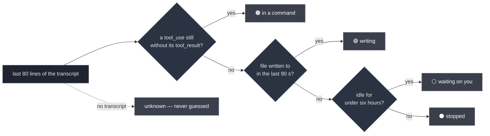

<div align="center">


# sereno

### Nine agent sessions open. Which one is stuck?

**A terminal UI that tells you what every coding-agent session is _actually_ doing — not just that it exists.**

One Python file · zero dependencies · Claude Code, Codex, Gemini, Antigravity

<br>

[](https://github.com/ElRaxy/sereno/actions/workflows/ci.yml)
[](https://github.com/ElRaxy/sereno/releases/latest)
[](https://www.python.org/)
[](#-install)
[](#-install)
[](LICENSE)
[](https://github.com/ElRaxy/sereno/stargazers)

**English** · [Español](README.es.md)

<br>


</div>

```bash
curl -fsSL https://raw.githubusercontent.com/ElRaxy/sereno/main/install.sh | sh
sereno
```

---

## Contents

- [Why](#-why)
- [The four states](#-the-four-states-and-why-theyre-hard)
- [Reading a row](#-reading-a-row)
- [Install](#-install)
- [Use](#-use)
- [Where the data comes from](#-where-the-data-comes-from)
- [What it does, and what it doesn't](#-what-it-does-and-what-it-deliberately-doesnt)
- [Privacy](#-privacy)
- [Requirements](#-requirements)
- [FAQ](#-faq)
- [Configuration](#-configuration)
- [Notes on the source](#-notes-on-the-source)
- [Contributing](#-contributing)
- [Credits](#-credits)

---

## 🌙 Why

A *sereno* was the night watchman who walked Spanish streets until the 1970s, carrying a
lantern and the keys to every door on his round. You slept; he checked. When something was
wrong, he was the one who knew.

Right now you have nine terminal tabs open. Two agents are mid-task. One has been blocked on
its own `pytest` for eleven minutes. One finished twenty minutes ago and is waiting for you.
One is eating 900 MB for a job you abandoned before lunch.

From the outside, all nine look identical. Finding out which is which means clicking through
all nine, reading the last screen of each, and losing your place.

**Session managers tell you the nine exist. `sereno` tells you what they are doing.**

---

## 🔎 The four states, and why they're hard

|  | what it means | why `ps` can't tell you |
|:--|:--|:--|
| 🟢 **writing** | producing an answer right now | — |
| 🟠 **in a command** | it issued a tool call and the result never came back | **this is the one that matters** |
| ⚪ **waiting on you** | it finished, nobody replied | looks identical to "it crashed" |
| ⚫ **stopped, waiting on you** | same, but over six hours ago | these are the ones worth closing |

An agent sitting in a three-minute `Bash` call **writes nothing to its transcript**, so by
file mtime it looks idle — and idle looks abandoned. `sereno` reads the tail of the transcript
and checks whether the last `tool_use` ever got its matching `tool_result`.

That single check is the difference between *"it hung"* and *"it's working, leave it alone"*.



To `ps`, all four are the same live process. The order matters too: **the tool check wins over
"is it writing"**, because a `tool_use` line was itself just written to the file, so both are
true at once and only the second one tells you anything.

> Every state is composed **in code** from typed facts read off the transcript — two booleans
> and a timestamp. No model is asked to summarise anything, so nothing can confidently tell
> you a session is fine when it isn't. When the facts are missing the row says `unknown`
> rather than picking the friendly answer.

---

## 📖 Reading a row

```
 ▎ ◐ Refactor payment webhooks  checkout-api ⎇feat/webhooks      now ▰▰▰▰▱  88% 512 MB
 │ │            │                    │            │               │     │     │     │
 │ │            │                    │            │               │     │     │     └ memory
 │ │            │                    │            │               │     │     └ % of the window
 │ │            │                    │            │               │     └ context used
 │ │            │                    │            │               └ idle time, by age
 │ │            │                    │            └ git branch
 │ │            │                    └ project
 │ │            └ title — the one Claude gave itself, or your /rename
 │ └ ◐ in a command · ● writing · nothing = waiting on you
 └ cursor. Turns yellow when the row is marked.
```

Between the state and the title there is one more column, and it carries two warnings: `⧉`,
another session is writing in the same place, and `↻`, this one is going in circles. When both
apply the clash wins the column — miss that one and two sessions can overwrite each other's
work; miss the other and you lose minutes. Both show in full in the panel and in `--list`.

**The title is the last thing to be cut.** Narrow the window and the support columns go first,
in this order: memory, then the project (which narrows before it goes), then the context bar.
The title keeps its width down to about 45 columns, because it is the one thing that tells two
sessions apart. Widening never takes a column away again, so resizing doesn't make the row
jump.

A column with nothing to say takes no space at all: no tmux means no memory column, and a
Codex tab means no context column, rather than eighteen blanks on every line.

The panel on the right shows that session's **last prompt and last reply**, so you can decide
whether to go back to it without opening it — plus the exact context figures (`176k / 200k`)
and the model.

### What it has been doing

The panel says what a session did last. What it does not say is the **path**, which is where
you see whether it is getting anywhere or going in circles. Under the prompt and the reply
there is a short trail of the last tool calls, each with how long it took and how it ended:

```
▸ what it has been doing  (+4 earlier)
  ! the same command has failed 3 times
  ·    2s  Read · tests/webhooks/test_retry.py
  ·    1s  Edit · src/webhooks/handler.py
  ✗   34s  Bash · pytest tests/webhooks -x -q
  ✗   31s  Bash · pytest tests/webhooks -x -q
  ✗   33s  Bash · pytest tests/webhooks -x -q
  ◐   12m  Bash · pytest tests/webhooks -x -q
```

`·` done · `✗` came back an error · `∅` a search that found nothing · `◐` still running, with
the clock ticking.

The two lines that start with `!` are the only judgements on the page, and neither is a guess:
they are counted, not sensed. **The same command failing three times in a row** is where a
person stops and looks; three is also the retry budget this project already uses everywhere
else. **Two searches in a row that find nothing** is the other one, and it is two and not three
on purpose — one failed retry can be a flake, but a second search that comes back empty already
says the question is wrong. Anything else in between resets the count: two empty greps with an
edit between them are work, not a sweep.

It costs no extra reading. The trail comes out of the same tail of the transcript the panel
already opens, and only for the row under the cursor — and the same two counts are computed for
every row on screen, out of the pass `sereno` already makes, which is what puts the `↻` in the
list without waiting for you to walk over to that row.

**Expect this to stay quiet.** Over 10,375 real tool calls from the twelve largest transcripts
on the machine this was built on, the loop warning fired on **zero** windows and the sweep on
**one**. That is not a bug and the thresholds were not loosened to produce a nicer number: when
a command fails, the next attempt is usually a slightly different command, so a literal
three-in-a-row is rare. A warning that shows up constantly is a warning you stop reading, and
the counts stay where the evidence put them.

Twenty minutes stuck on one call does **not** get a line of its own — `status` already says
that, and the same fact twice is not a second opinion. The trail shows it as what it is: a
glyph and a clock.

### About that context bar

It answers the question you currently answer by opening the session: *can this one take
another task, or is it about to compact?* The number is read from the transcript — every reply
records what it cost — so nothing is estimated and no API is called.

The **ceiling** is the one thing Claude Code does not write down. A session running the
one-million window still records itself as `claude-opus-5`, exactly like a 200k one. So sereno
works it out in this order, and stops at the first that answers:

1. `SERENO_CTX_MAX`, if you set it. You said it, it stands.
2. **What this session says.** First the `cost-state` line the CLI writes when it closes — its
   `modelUsage` is keyed by `claude-opus-5[1m]`, suffix included — and failing that, a `[1m]`
   suffix on the model in the transcript.
3. The `model` in your `~/.claude/settings.json`. That is the *machine*, not the session.
4. Otherwise, the standard window.
5. On top of all of 2–4, a guard: the ceiling can never end up below the context already seen.
   A session holding 560k is not on a 200k ceiling whoever says otherwise.

Rule 5 is what keeps the bar honest: the percentage can never read above 100%, and there is a
test that fails if it ever does.

**And that guard has memory: it looks at the peak too**, not just the context right now.
Compacting destroys the evidence — the window drops to 16k and a one-million session starts
being drawn against the standard one — so the peak is rebuilt from the transcript: the `usage`
of every reply and the `preTokens` of every compaction, which is context and not a running
total (checked against the preceding reply: median +0.4%, 165 of 169 within ±5%).

Across the 524 transcripts on the machine this was written on, the peak corrects **30** (5.7%),
all of them the same way: one read 171k against 200k — an **86%**, "compact now" — when it was
171k of a million, a **17%**. As coverage, `preTokens` shows up in 107 of 524 transcripts against
13 for `cost-state`.

#### The bar remembers where it has been

Compacting resets the number but not the session. A session on its 700th turn that has compacted
twice reads **11%** and looks like the freshest row on the list, right when it is the most worn
one — while an untouched session at 36% looks heavier than it is. That is backwards, and it is
the reading you use to decide whether a session takes another task or gets closed.

So the bar draws both. Filled cells in colour are what it holds **now**; filled cells in grey are
where it **has been**; hollow cells it has never reached.

```
▰▰▱▱▱   36%     never compacted — what you see is what it holds
▰▰▰▱▱   11%     compacted twice: it reached 52% before
```

The percentage is untouched — it is still the context of right now. Only the cells remember; a
peak that inflated the number would say the session is full, which is the opposite of true.

Two deliberate limits. The peak is `0` until the transcript has been read whole, and `0` draws
nothing: a session still loading shows the plain bar rather than a wrong one. And with no colour
in the terminal the grey cells are not drawn at all — the only thing separating "holds" from
"held" is the colour, and without it a fuller bar would simply lie upwards.

The peak comes from reading the whole transcript, and **the list now does that too**, a chunk per
refresh: see [Reading without blocking](#reading-without-blocking). And the opposite direction —
proving a session is *not* on the big window — has no evidence beyond `cost-state`: across those
524 transcripts there is not one auto-compaction (which would give away the threshold) and not a
single `message.model` carrying the suffix.

**2 comes before 3, and it goes both ways.** Your global config is the weak one — a session
launched with a different `--model` does not obey it — so the one fact that describes *this*
session overrules it, raising the ceiling **and** lowering it. Before this order, a 200k session
on a machine configured for the big window was drawn against a million: 6% where 30% was due.

The lowering direction rests on a case not seen on the machine this was written on: of the 15
transcripts carrying `cost-state`, the 11 that name a main model name it with the suffix, and
the other four carry an empty `modelUsage`. Rule 5 bounds what can go wrong — dropping below
what has already been spent is impossible. The Haiku the CLI uses for titles is ignored when
reading that line, or a throwaway conversation would talk the ceiling down on its own.

---

## ⚡ Install

There is nothing to install, really. `sereno` is one Python file. Every route below ends with
that same file sitting somewhere on your `PATH`.

**The one-liner**

```bash
curl -fsSL https://raw.githubusercontent.com/ElRaxy/sereno/main/install.sh | sh
```

**From the Releases page, no piping into a shell**

If you'd rather not pipe a script from the internet into `sh` — and you shouldn't, as a habit —
go to [**Releases**](https://github.com/ElRaxy/sereno/releases/latest), download the `sereno`
asset in your browser, and then:

```bash
chmod +x ~/Downloads/sereno && mv ~/Downloads/sereno ~/.local/bin/
```

Each release ships a `SHA256SUMS` file next to it. To check what you downloaded is what I
published:

```bash
cd ~/Downloads && shasum -a 256 -c SHA256SUMS      # sha256sum -c on Linux
```

**From the repository page**

Open [`sereno`](https://github.com/ElRaxy/sereno/blob/main/sereno) and use GitHub's download
button. It's the same file the installer fetches, at whatever `main` says today.

**With git, if you'd rather follow along**

```bash
git clone https://github.com/ElRaxy/sereno.git && ln -s "$PWD/sereno/sereno" ~/.local/bin/sereno
```

The symlink means `git pull` updates the command.

**Read the installer before running it**

```bash
curl -fsSLo /tmp/install.sh https://raw.githubusercontent.com/ElRaxy/sereno/main/install.sh
less /tmp/install.sh && sh /tmp/install.sh
```

It's 32 lines: it checks you have Python 3.8+, downloads one file into `~/.local/bin`, and
tells you if that directory isn't on your `PATH`. Set `SERENO_BIN` to put it elsewhere.

---

Python 3.8+ is the whole dependency list. No venv, no lock file, no supply chain. `scp` it to a
server and it runs there too. To uninstall, delete the file.

> **No Homebrew, no package manager, and that's deliberate.** A formula is a second copy of the
> version number that goes stale the week you forget it. If enough people ask, I'll reconsider —
> [open an issue](https://github.com/ElRaxy/sereno/issues).

---

## 🕹 Use

```bash
sereno            # the picker
sereno --list     # plain list, touches nothing
sereno --json     # the same facts, for your statusline or your scripts
sereno --watch    # sit there and tell you the moment one stops and waits on you
sereno --find "the thing you half remember"
sereno --usage    # add what each session has burned
sereno --help
```

### `--find`

For the session you know you had and cannot find. It searches **what was said** — your prompts
and the agent's replies — and prints the matches with enough of a line around them to
recognise, then opens the picker with only those, so `ENTER` puts you back inside.

```bash
sereno --find "webhook idempotency"
sereno --find "webhook idempotency" --all     # everything, not just the 200 most recent
```

Searching the raw files instead would have been three lines shorter and useless. Measured over
506 transcripts here: 287 files contained the word, 25 had it in something a human or the agent
actually said. The rest were `tool_result` dumps — greps, file contents, command output — and
the project's `CLAUDE.md`, which the CLI pastes into **every** session. With those in, any word
from your own project matches everywhere.

### `--watch`

Leave it in a spare pane. It says nothing until a session **stops working** — the transition
from writing (or running a command of its own) to waiting on you. Not "it is idle": most of
them are idle most of the time, and an alert you get every twenty seconds is one you stop
reading.

```bash
sereno --watch              # every 20s
sereno --watch --every 60
```

It reports three transitions, and only transitions: a session **stopping**, two sessions
**starting** to write in the same place, and one **starting** to go in circles. Twenty minutes
of the same loop is one line, not one per poll — and a session that is already looping when you
start `--watch` is part of the baseline, not news.

You get a desktop notification (`osascript` on macOS, `notify-send` on Linux — both already on
your system) and a line on stdout, so it works over SSH and pipes fine. The first pass is
always silent: it only sets the baseline, otherwise starting it would announce everything you
already knew.

`--json` gives you every session with a stable `state`
(`writing` · `in_command` · `waiting` · `stopped` · `unknown`), its context figures, memory and
idle seconds. **It carries no conversation** — no prompt, no reply, nothing that was said. The
picker can show you that because you are looking at your own screen; a pipe cannot, so it
doesn't. A test fails if a field ever sneaks one in.

```bash
sereno --json | jq -r '.sessions[] | select(.state=="waiting") | .title'
sereno --json --all      # add the resumable history, the equivalent of pressing TAB
sereno --json | jq -r '.sessions[] | .session_id'   # to hand to `claude --resume`
```

**`id` and `session_id` are not the same thing, and it is worth knowing which you want.** `id` is
the **row key**: the tmux session name for a live one (`cc-VanguardIA-90a6fb95`) and the uuid for
one from history — good for matching rows across two calls. `session_id` is the **Claude session
id**, the one `--resume` takes, and it is `null` when the row belongs to another CLI. They were
mixed into one field until 1.10.0, and in the picker that meant the copy key handed you a tmux
name that resumed nothing.

<details>
<summary><strong>Three things worth wiring it into</strong></summary>

<br>

**A shell prompt that says how many are waiting on you.** Cheap enough to run on every prompt,
and silent when the answer is zero:

```bash
sereno_wait() {
  local n
  n=$(sereno --json 2>/dev/null | jq '[.sessions[] | select(.state=="waiting")] | length')
  [ "${n:-0}" -gt 0 ] && printf ' ⏳%s' "$n"
}
PS1='$(sereno_wait) \w $ '
```

**A tmux status bar with the session closest to compacting.** The one you want to know about is
the one running out of window, not the one using the most memory:

```bash
# .tmux.conf
set -g status-right '#(sereno --json | jq -r "[.sessions[] | select(.context_max>0)] \
  | max_by(.context_tokens/.context_max) \
  | \"\(.title[0:24]) \(.context_tokens*100/.context_max | floor)%\"") '
```

**Anything that needs to wait for an agent to finish.** `state` is a closed enum, so this is a
loop and not a guess:

```bash
until [ "$(sereno --json | jq -r '.sessions[] | select(.id=="'"$id"'") | .state')" = waiting ]; do
  sleep 20
done
say "it wants you"
```

Every field is typed and every state comes from that same enum, so nothing here has to parse
prose. `context_max` is `null` when the ceiling is unknown, which is why the tmux line filters
on it first.

</details>

| key | |
|:--|:--|
| `↑` `↓` / `j` `k` | move |
| `ENTER` | open it |
| `SPACE` | mark · `v` a range · `a` all · `i` invert · `d` everything idle over an hour |
| `x` | close the marked ones — asks first, and warns if any is mid-task |
| `s` / `S` | sort by activity · context · project · memory · **spend** / invert |
| `y` | copy the session id, the one `claude --resume` takes |
| `/` | filter by title as you type |
| `TAB` | Claude · resumable history · Codex · Gemini · all |
| `?` | everything else |

**The mouse works.** Click to select, double click to open, right click (or the bar on the
left edge) to mark, wheel to scroll. The tabs at the top and the buttons along the bottom are
real buttons.

Nothing drops you out of the picker. Closing four sessions and opening a fifth is one visit,
not five.

### `--usage`

The context bar says how full the window is **right now**. It does not say how much a session
has burned: one that has compacted three times reads 20% with twelve hours inside it. `--usage`
adds that — tokens in and out, cache read, how many replies, how many compactions, the peak
context it reached, and the
minutes actually spent working.

```bash
sereno --list --usage
sereno --json --usage | jq -r '.sessions[] | "\(.title)  \(.output_tokens) out"'
```

It is off by default because the figure lives all over the transcript: the tail is no use, the
whole file has to be read. Measured here, that is 0.11 ms for the median transcript and 223 ms
for the largest on disk (89 MB) — fine when you ask for it, wrong for a statusline that runs
every few seconds. In the picker it costs nothing extra: it is read for the row under the
cursor, like the rest of the panel, and cached.

Four figures, and **no total**. Cache read is not new material — it is what was already sent
being read again — and it runs a hundred times larger than everything else put together (300M
against 3M in an eight-hour session). Adding it to the input gives a huge number that means
nothing, so the four parts stay apart and whoever wants a total composes it knowing what they
are adding.

**What it does not count**, and this matters if you delegate: subagent turns and the Haiku calls
the CLI makes on its own (titles, summaries) leave no line in the transcript. Cross-checked
against the `cost-state` the CLI itself writes, the scan matches within 0.1% on five transcripts
of eight and falls up to 21% short on two. The fields are called `input_tokens` / `output_tokens`
— what the transcript recorded — not "what you were charged", which is a different thing.

That other thing travels apart, as `api_cost_usd` in `--json --usage` only: the `totalCostUSD`
the CLI wrote with its own prices, relayed as-is. `sereno` carries no price table — one in a
public repo goes stale without telling anyone — and it never puts a dollar figure in the TUI,
where on a subscription plan it would be money you did not pay.

#### Sorting by what it burned

`s` cycles the modes and the fifth one is **spend**: the heaviest first, new input plus output.
It is the only one of the five that sorts on something it has to go and read, so it reads once,
when you enter the mode — 94 ms for the 8 live sessions on this machine and 389 ms for the 40 in
history the first time, then nothing.

It is not the context bar under another name, and the case above is what separates them:
**compacting empties the window and does not give back what was already spent**. Measured here
across 40 sessions, the three that had compacted ranked 2nd, 3rd and 4th by spend and 5th, 7th
and 8th by context. Against *activity* there is no resemblance at all (rho 0.13): that one sorts
by recent, not by accumulated.

Which figure you pick barely matters — `out`, `input+output` and `cache read` correlate at
rho ≥ 0.98 with each other across those 40 transcripts and share the same top 5 — so it takes the
one that fits in a line. Money is out for a different reason: `totalCostUSD` is only written by
the CLI **on exit**, so it was present in 16 of 40 sessions and in **none** of the live ones.

You can leave it on: `SERENO_SORT=spend`, or `-spend` to invert it.

### 🎭 Try it without touching your data

```bash
sereno --demo          # or SERENO_DEMO=1 sereno
```

Invented sessions, invented projects. **Use this for anything you publish.** The detail panel
shows real prompts and real replies, so a screenshot of a session manager is an unusually
efficient way to leak a client's work — the first take of the GIF above went out with customer
names in it, which is why demo mode and a test that guards it both exist.

### 🔔 One line when you open a terminal

```bash
# ~/.zshrc or ~/.bashrc
sereno --hook
```

Prints one line when something is running, and absolutely nothing when there isn't.

---

## 💾 Where the data comes from

Claude Code already writes everything, in `~/.claude/projects/<project>/<uuid>.jsonl`: one line
of JSON per event, appended as the session runs. `sereno` reads the **last 80 lines** of at most
40 of those files and derives everything from them. Nothing else exists — no config file, no
daemon, no index, no telemetry, no API call. Install it and it already knows about every session
you have ever run.

| what it reads | what it gets out of it |
|:--|:--|
| the file's mtime | is it writing right now |
| the last `tool_use` / `tool_result` pair | is it stuck inside a command |
| `message.usage` on the last reply | context spent, and the model |
| `cwd`, `gitBranch` | project and branch |
| `aiTitle`, `lastPrompt` | the title and the panel |

That costs **4 ms** for the live sessions and **16 ms** for the whole history, measured against
1,248 transcripts and 3.8 GB. The results are cached by mtime, so a file that hasn't moved isn't
read twice.

Codex, Gemini and Antigravity come from their own history directories and reopen with their own
`resume` command. They are files on disk, not live processes, so `sereno` refuses to "close" them
rather than pretending it did something.

<details>
<summary><strong>Optional: tmux and Warp</strong></summary>

<br>

If your sessions run inside tmux you also get live memory per session, which ones already have a
terminal attached, and the ability to actually kill them. On macOS with Warp, `ENTER` opens a
session in a **new window** instead of taking over the one you're reading.

Both optional. Without them everything works except the memory column — which then takes no space
at all, rather than sitting there empty — and `ENTER` execs into the session in the current
terminal.

</details>

---

## 📊 What it does, and what it deliberately doesn't

Almost everything else in this space **launches and orchestrates** sessions: it starts the agents,
so it knows about them because it made them. `sereno` starts nothing. It reads what the CLIs
already wrote, which is why it sees sessions you opened last month, from a terminal it has never
heard of, on a machine you're SSH'd into.

**It will never:**

- **launch or orchestrate agents.** That's the whole crowded half of this space, and the half
  that has to own your workflow to work at all. Use one of those to spawn a fleet, then use this
  to see what the fleet is doing.
- **write to a transcript, or to anything that belongs to a session.** It kills processes you
  pick, and that's the only destructive thing in it.
- **send anything anywhere.** There is no networking code at all, and a test in CI fails the
  build if any appears.
- **ask a model what it thinks.** Every state is composed in code from typed facts.

What that buys you, concretely:

|  | sereno | launchers and session managers | desktop apps |
|:--|:--:|:--:|:--:|
| Sees sessions it didn't start | ✅ | ❌ | 🟡 |
| Live per-session state | ✅ | ❌ | 🟡 |
| Last prompt + last reply | ✅ | ❌ | 🟡 |
| Context spent per session | ✅ | ❌ | ❌ |
| Works with zero setup | ✅ | needs its launcher | needs install |
| Codex / Gemini too | ✅ | Claude only | Claude only |
| Runs over SSH | ✅ | ✅ | ❌ |
| Dependencies | **none** | tmux | Electron / Swift |

---

## 🔒 Privacy

It reads your prompts and your agent's replies to draw them on your screen. That deserves a
straight answer, not a promise:

**`sereno` has zero networking code.** No `socket`, no `urllib`, no `requests` — the whole
import list is `os, sys, json, re, shlex, shutil, subprocess, time, datetime, pathlib,
unicodedata` and `curses`. Nothing it reads can leave your machine, because there is nothing
in it that can send anything anywhere.

The only external programs it ever runs are `ps` (memory), `tmux` (list and kill sessions),
`open` (hand a session to Warp), `defaults` (read your macOS locale) and — only under
`--watch` — `osascript` / `notify-send` for the desktop alert. No telemetry, no analytics, no
update check, nothing phoning home.

One thing worth saying plainly: a `--watch` alert puts the **session title** into your system's
notification centre, which on a shared or screen-shared machine is a place you may not want it.
The alert carries the title and the project, never the conversation.

`tests/test_sin_red.py` walks the AST on every CI run and fails if a networking import appears,
or if a new external binary shows up that isn't on that list. You don't have to take my word
for it — the test *is* the word.

[`SECURITY.md`](SECURITY.md) has the full list of what it reads, what it writes and what it
runs, and it's where to report anything exploitable.

---

## ✅ Requirements

| | |
|:--|:--|
| **macOS** | works, and it's where it was built |
| **Linux** | works — CI runs the real TUI in a pty on Ubuntu |
| **Windows** | no. `curses` isn't in the Python standard library there. **WSL is fine** |
| **Python** | 3.8 or newer, no packages |
| **Terminal** | any. Uses 256 colours when available, degrades cleanly when not |

---

## 🩺 FAQ

<details>
<summary><strong>I installed it and it shows nothing</strong></summary>

<br>

Check `ls ~/.claude/projects` — that's the only thing it needs. If the folder is empty you
haven't run Claude Code on this machine (or `$HOME` isn't what you think, which happens under
`sudo`).

If it lists sessions but the ones you expected are missing, they're probably in the
**`history`** tab rather than `claude`: anything whose transcript hasn't moved in 90 seconds
counts as resumable, not live. Press `TAB`.

</details>

<details>
<summary><strong>`x` says "history, not processes: nothing to close"</strong></summary>

<br>

Correct, and deliberate. Without tmux there's no process to kill — the session is a file on
disk. `sereno` refuses instead of pretending it did something. Use `ENTER` to resume it, or
delete the transcript yourself if you want it gone.

</details>

<details>
<summary><strong>The memory column is empty</strong></summary>

<br>

Memory is per-process, and it only knows the process if the session runs inside tmux under the
socket it watches (`SERENO_TMUX_SOCK`, default `claude-code`). Everything else still works.

</details>

<details>
<summary><strong>Does it slow anything down? Does it touch my sessions?</strong></summary>

<br>

It reads the **tail** of at most 40 transcripts and caches by mtime — 4 ms for the live ones,
16 ms for the full history, measured against 1.248 transcripts and 3,8 GB. It never writes to a
transcript. The only thing it ever writes is a Warp launch file, and only when you press
`ENTER` on a machine that has Warp.

</details>

<details>
<summary><strong>How do I uninstall it?</strong></summary>

<br>

```bash
rm ~/.local/bin/sereno
```

That's it. It creates no config, no cache and no state directory of its own.

</details>

---

## 🔧 Configuration

There is no config file. Everything is an environment variable, so nothing about it survives
you deleting the script.

| Variable | Default | |
|:--|:--|:--|
| `SERENO_LANG` | your locale | `en` or `es`. On macOS it reads `AppleLocale` |
| `SERENO_DEMO` | off | `1` for invented sessions. Set it before any screenshot |
| `SERENO_CTX_MAX` | worked out | context ceiling in tokens, when the cascade gets it wrong |
| `SERENO_SORT` | `activity` | which sort the picker opens on: `context`, `project`, `memory`, `spend`. A `-` in front inverts it |
| `SERENO_TMUX_SOCK` | `claude-code` | which tmux socket to read |
| `SERENO_REGISTRY` | `~/.claude/warp-sessions` | where the optional launcher registry lives |
| `SERENO_BIN` | `~/.local/bin` | where `install.sh` puts the file |
| `SERENO_DEBUG` | off | `1` stops the picker swallowing a curses error. Use it if it
  exits without saying why |

```bash
# a one-million window, in English, without touching anything permanent
SERENO_CTX_MAX=1000000 SERENO_LANG=en sereno
```

---

## 🧠 Notes on the source

One file, about 3,200 lines, standard library only.

**The comments are in Spanish.** They explain *why* each decision is the way it is, usually
naming the incident that caused it, and translating that would flatten it into generic prose.
The interface is bilingual; the reasoning is in the author's language. Issues and PRs in
English are very welcome.

<details>
<summary><strong>Three decisions worth knowing about</strong></summary>

<br>

**The cursor row changes background, not video.** `A_REVERSE` repaints the whole row white and
throws away the colour of every column — the state, the project, the memory — on the one row
you're actually looking at.

**Mouse events are parsed by hand.** The ncurses that ships with macOS is 6.0 from **2015** and
only speaks the 1988 x11 mouse protocol, where the column travels in a single byte and dies at
column 223. On a wide window, clicks in the right-hand panel land somewhere else entirely.
`sereno` requests SGR and parses it itself, while still accepting `KEY_MOUSE` from a modern
ncurses.

**`agent-*.jsonl` are not sessions.** Claude Code drops its subagent transcripts next to the
real ones — 213 against 1.035 on the machine this was built on. They aren't resumable and have
no title of their own, so the list drowned under twenty copies of the same subagent prompt
until they were filtered out.

</details>

---

Changes between versions are in [CHANGELOG.md](CHANGELOG.md).

## 🤝 Contributing

Issues and pull requests welcome, in English or Spanish. Run the tests before you open one:

```bash
for t in tests/test_*.py; do python3 "$t"; done
```

There are nineteen, and CI runs all of them on macOS and Ubuntu across Python 3.8, 3.12 and 3.13.
Most guard against something that fails **silently**, which is why they exist at all:

- **`test_demo_aislado.py`** — demo mode must not return a single row that came from real disk.
  Plants a canary in a fake `HOME` and walks every function that reads data.
- **`test_i18n.py`** — every string printed goes through `_()` and has a Spanish entry with the
  same `{placeholders}`. It walks the AST, so a hardcoded phrase is caught too. English is the
  key, so a missing translation never crashes; it just quietly shows the wrong language.
- **`test_sin_red.py`** — no sockets, and no external binary beyond the declared list.
- **`test_contexto.py`** — the context bar can never read above 100%.
- **`test_json_sin_conversacion.py`** — `--json` carries no prompt and no reply.
- **`test_uso.py`** — three lines of the same reply count once, cache read never joins the
  input, and reading only what is new gives exactly what reading the whole file gives.
- **`test_recorrido.py`** — a loop is three failures of the *same* command, a sweep is two
  empty searches in a row, and nothing unobserved ever counts as success.
- **`test_panel_geometria.py`** — the terminal is replaced by a stand-in that records every
  write, so no cell gets painted twice and nothing spills out of the frame.
- **`test_orden_en_pantalla.py`** — the sort key reaches `spend`, the list is painted in that
  order, and a half-read row shows "reading…" rather than a figure. With the rows EMPTIED of
  usage: the demo ships it precooked, and with it in place the test passed even without the
  wiring it claims to cover.
- **`test_nombre_e_id.py`** — the title is cut at the first sentence, two sessions sharing a
  name are separated by their short id, and the id shown and copied is the Claude session id
  rather than the tmux session name.
- **`test_suelo_38.py`** — nothing uses syntax newer than 3.8. The CI already runs on 3.8,
  but it tells you late: whoever wrote the line has 3.12 and it compiles fine there.
- Plus the TUI booting in a pty, `--watch` firing on the edge, `--find` reading only speech,
  unknown flags being reported, and a resumed session being followed to its live transcript.

Two house rules:

- **A test you haven't seen fail doesn't count.** Break the code on purpose, watch it go red,
  then fix it. Half the tests here were written that way after the first version passed
  something it shouldn't have.
- **GitHub Actions are pinned by commit SHA**, and the repository enforces it, so a workflow
  edit using `@v4` will be rejected. Dependabot raises the bumps.

Regenerate the demo with `vhs demo.tape` ([vhs](https://github.com/charmbracelet/vhs)) — and
look at the frames before you commit them. `SERENO_DEMO=1` first, always: the panel shows real
prompts.

The social card is `docs/social-preview.png`, and the four steps that rebuild it are in the
header of `docs/social-preview.html`. Its strip is a real capture of the program in demo mode,
not a mockup, so it goes stale when the interface changes. It is the one artefact that cannot be
pushed from here: GitHub has no API for it, so it is uploaded by hand in **Settings › General ›
Social preview** and checked by reading the `og:image` of the repo's public page.

Anything exploitable goes to [`SECURITY.md`](SECURITY.md), not to a public issue.

---

## 👤 Credits

Built by **[Alex Micó](https://github.com/ElRaxy)**, who had nine Claude Code tabs open at
the time and no idea which one to go back to.

Written with **Claude Code (Opus 5)** as co-author — including the afternoon spent discovering
that macOS ships a 2015 ncurses. Fitting, for a tool whose whole job is watching Claude Code
sessions.

If it saves you one round of clicking through nine tabs, a ⭐ helps other people find it.

---

## 📄 Licence

MIT — see [LICENSE](LICENSE). Do what you want with it.
